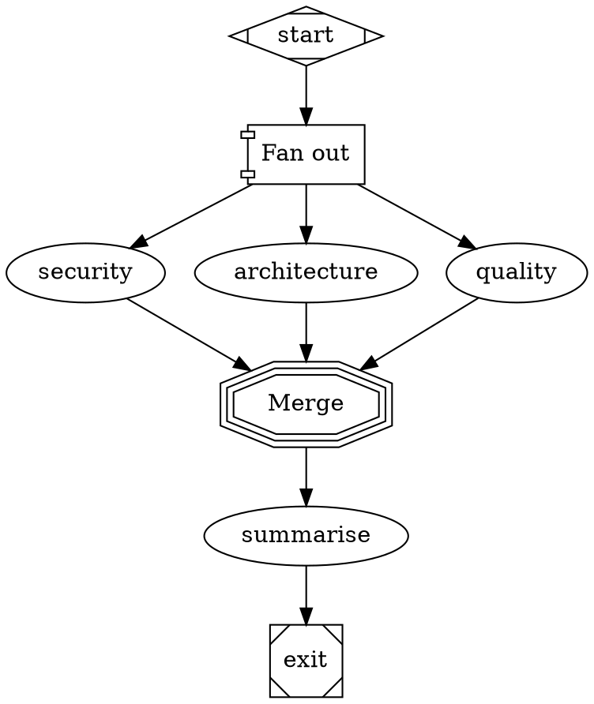
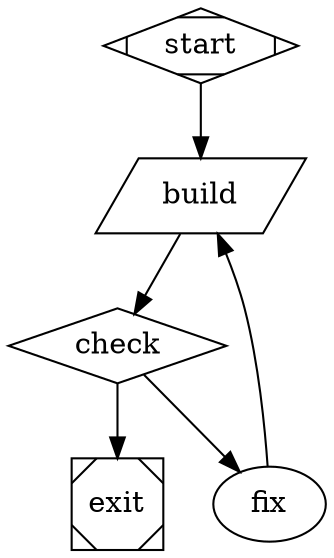

# Attractor runner — a BB-native software-factory assembly line

Date: 2026-09-13. Status: implementation complete (T1-T7) on branch
`bb/extend-bb-workflow-functionality-thr_mh3muw5kys` — see
`plugins/bb-plugin-attractor/README.md`'s "Status" section and "Deviations
from the plan" for what actually shipped per task, including a few
deliberate readings of underspecified corners of this plan.

## Goal

A new BB plugin, `plugins/bb-plugin-attractor`, that runs **Graphviz DOT
workflow definitions** (the StrongDM Attractor dialect, plus the Fabro
extensions that matter for a software factory) with **BB threads as the
agent backend**, and renders the **workflow DAG with live execution state**
(current node, visited path, per-node status, visit counts, timing) inside
BB chat and the thread side panel.

Why a new plugin and not a change to BB's built-in Workflows plugin: the
built-in ships as `dist/` only inside `bb-app` and plugins cannot share
SQLite state. Everything the runner needs is public plugin-SDK surface.

Why Attractor rather than another engine: every DOT engine (Fabro, Kilroy,
Smasher, attractor-pi-dev, …) is the same three-layer design — LLM client,
agent loop, pipeline engine. BB already provides the first two layers
(providers, threads). Only the pipeline engine is missing. See the spec at
https://github.com/strongdm/attractor/blob/main/attractor-spec.md and the
Fabro dialect reference at https://docs.fabro.sh/reference/dot-language.

## Non-goals (v1)

- Fabro `fidelity=full` / `thread_id` conversation continuity across nodes.
- `for_each` parallel cloning, `insulator` wait nodes, `house` manager loops,
  MiniJinja templating, `@file` prompt references, `retry_policy` backoff
  families, `selection=random`.
- Delegating to a Fabro server (that is `plugins/bb-plugin-assembly-lines`,
  which must not be modified by this work).
- Runs board across threads.

## Repository conventions that apply

- Plugin is an **isolated npm package** (own `package.json`, lockfile,
  `node_modules`), like `plugins/canvas` and the (untracked, do not touch)
  `plugins/bb-plugin-assembly-lines`. It is NOT part of the root Bun workspace.
- Toolchain on this box: node v22, npm 10, `bb` CLI 0.43 (`bb plugin build .`).
  The default npm cache is not writable in the agent sandbox; always run npm
  as `npm --cache "$PWD/.local/npm-cache" <cmd>` from the plugin directory
  (`.local/` is gitignored at the repo root; add `.local/` to the plugin's
  own `.gitignore` too).
- Verify every task with, from the plugin directory:
  `npm run typecheck`, `npm test`, and `bb plugin build .`.
- Strict TDD: write the failing test first, see it fail, then implement.
- Commit at the end of every task on the current branch with a conventional
  message (`feat(attractor): …`) ending in
  `Co-Authored-By: Claude Fable 5.1 <noreply@anthropic.com>`. Never push.
  Never run bare `git stash`.
- Do not modify files outside `plugins/bb-plugin-attractor/` and this plan
  document, except `docs/` additions requested by a task.
- Pin `@get-bb/plugin-sdk` devDependency to `0.4.84` (matches sibling
  plugins; bb 0.43 runtime). `engines`: `{ "bb": ">=0.43", "bbPluginSdk": ">=0.4.84" }`.

## Plugin layout

```
plugins/bb-plugin-attractor/
  package.json            bb.name "Attractor", bb.server ./server.ts, bb.app ./app.tsx, bb.host ./host.ts, bb.skills ["skills"]
  tsconfig.json           copy of plugins/canvas/tsconfig.json shape (strict, ES2022, bundler, react-jsx, DOM lib, types node, noEmit)
  vitest.config.ts        environment node; app tests use jsdom via // @vitest-environment jsdom
  .gitignore              dist/ node_modules/ .local/
  README.md
  dot/
    lexer.ts parser.ts    DOT text -> AST (Graph)
    graph.ts              AST -> typed WorkflowGraph (shape->handler, attribute typing, defaults)
    validate.ts           lint rules -> Diagnostic[]
    conditions.ts         condition expression parser + evaluator
    stylesheet.ts         model_stylesheet parser + resolver
  engine/
    types.ts              Outcome, Context, Handler, Event, RunState, Checkpoint
    context.ts            key-value context with deep-copy for branches
    router.ts             next-node selection cascade
    engine.ts             the walker (visits, goal gates, on_failure, retry targets, parallel)
    events.ts             typed event emitter
  handlers/
    agent.ts prompt.ts command.ts conditional.ts human.ts parallel.ts start-exit.ts
  server/
    store.ts              SQLite runs/stages/events (bb.storage.database + migrate)
    backend.ts            BB-thread CodergenBackend
    service.ts            run lifecycle, realtime publishing, resume
    contracts.ts          zod schemas + defineRpcContract (shared by server and app)
  host.ts host-contract.ts  host RPC entry: run shell scripts in the environment path
  server.ts               plugin entry: settings, tools, cli, rpc, agents.configure, background
  app.tsx                 messageDirective ::attractor-run{run="…"}, threadPanelAction, pendingInteraction
  ui/
    dag.tsx               dagre layout -> SVG DAG with execution overlay
    stages.tsx events.tsx run-panel.tsx
  examples/               *.dot workflows (plan-implement-review, parallel-review, branch-loop)
  skills/attractor/SKILL.md  agent-facing instructions for authoring/running/inspecting
  tests/                  (or *.test.ts next to sources — pick one and stay consistent)
```

## Supported DOT dialect (v1)

Graph: `digraph Name { … }` only. Semicolons optional. `//` and `/* */`
comments. Statement kinds: `graph [..]`, `node [..]` and `edge [..]`
defaults, node statements, edge chains `a -> b -> c [..]`, `subgraph`
blocks (only for scoping `node [..]` defaults; clusters carry no semantics).
Values: quoted strings with `\" \\ \n \t` escapes, integers, floats,
booleans, durations (`250ms 30s 15m 2h 1d`), bare identifiers.

Graph attributes: `goal`, `rankdir`, `model_stylesheet`,
`default_max_retries`, `on_failure` (`route|exit|succeed`), `retry_target`,
`fallback_retry_target`, `max_node_visits` (0 = unlimited).

Node shapes → handlers: `Mdiamond` start, `Msquare` exit, `box` (default)
agent, `tab` prompt (single LLM call, read-only tools), `parallelogram`
command, `hexagon` human, `diamond` conditional, `component` parallel
fan-out, `tripleoctagon` parallel fan-in. `type=` attribute may override the
shape. Reserved ids: `start Start exit Exit end End`.

Node attributes: `label`, `shape`, `type`, `class`, `prompt`, `script`,
`timeout`, `max_visits`, `max_retries`, `on_failure`, `retry_target`,
`fallback_retry_target`, `goal_gate`, `allow_partial`, `output_schema`
(`routing` | inline JSON Schema string), `model`, `provider`,
`reasoning_effort` (`low|medium|high`), `max_parallel`, `question_type`,
`join_policy` (`all|any|first` — v1 implements `all`), `stdin_source`.

Edge attributes: `label`, `condition`, `weight` (int, default 0),
`freeform` (human gates), `loop_restart` (parsed, ignored in v1).

Condition grammar (exact):

```
Expr     ::= Or ; Or ::= And ('||' And)* ; And ::= Unary ('&&' Unary)*
Unary    ::= '!' Unary | Clause
Clause   ::= Key Op Value | Key            (bare key = truthiness)
Op       ::= '=' | '!=' | '>' | '<' | '>=' | '<=' | 'contains' | 'matches'
Key      ::= 'outcome' | 'preferred_label' | 'context.' Path | Path
Value    ::= BareWord | '"' QuotedString '"'
```
`outcome` ∈ `succeeded | failed | partially_succeeded | skipped`.
Numeric ops compare numerically when both sides parse as numbers, else
lexically. `contains` = substring, or array membership when the context
value is an array. `matches` = JS RegExp test. Truthiness: non-empty, not
`"false"`, not `"0"`.

Routing cascade after a stage completes (Fabro semantics):
1. `jump_to_node` in the outcome bypasses edges.
2. Conditional edges whose condition is true; highest `weight`, then
   lexicographically smallest target id.
3. `preferred_label` in the outcome matched against edge labels (strip
   `[K] `, `K) `, `K - ` accelerator prefixes when comparing).
4. `suggested_next_ids` — first that names an existing outgoing edge target.
5. Failed outcome: effective `on_failure` — `route` keeps `failed` and falls
   through to step 6; `exit` skips unconditional edges (run ends unless a
   retry target applies); `succeed` rewrites to `succeeded` and re-runs 2–6.
6. Unconditional edges: highest weight, then lexicographic target.
7. Node then graph `retry_target` / `fallback_retry_target`, subject to
   `max_visits` of the target.
8. No next node → run terminates with this node's outcome.

Visits: `max_visits` (node) else `max_node_visits` (graph); reaching the
limit makes the node non-enterable (stage status `skipped`, routing
continues from step 7 as a failure). Goal gates: at exit, every visited
node with `goal_gate=true` whose last outcome is not `succeeded` or
`partially_succeeded` fails the run. Retries: `max_retries` per node with
fixed 1s/2s/4s delays (injectable clock/sleeper for tests).

Context keys written by handlers (Fabro-compatible): `last_stage`,
`last_response` (first 200 chars), `response.<node_id>` (full text),
`context_updates` merged from routing output, `command.output`,
`command.exit_code`, `human.gate.selected`, `human.gate.label`,
`human.gate.text`, `human.gate.<node>.answer|label`, `parallel.results`
(array of `{id,index,status,context_updates}`), `parallel.branch_count`.
Parallel branches get a deep copy of context; results nest under
`parallel.results` only (no top-level merge).

Routing output schema (`output_schema=routing`), what an agent returns:
`{ outcome: "succeeded"|"failed"|"partially_succeeded", preferred_next_label?: string, suggested_next_ids?: string[], failure_reason?: string, context_updates?: object }`.

Stylesheet: `selector { prop: value; … }` with selectors `*`, shape name,
`.class`, `#id`; specificity 0/1/2/3, last rule wins ties; explicit node
`model`/`provider`/`reasoning_effort` attributes override the stylesheet.
Properties: `model`, `provider`, `reasoning_effort`. Resolution to a BB
provider tuple happens in `server/backend.ts` (see SDK notes) and is
validated against the live catalog before spawning; unknown model → stage
fails with a clear error (no silent substitution).

Prompt assembly (`compact` fidelity only in v1): the worker prompt is the
graph `goal`, a bullet summary of prior stages (node id, label, status,
first 200 chars of response / command tail), then the node `prompt`. For
`output_schema` nodes, append the instruction to call the
`attractor_result` tool exactly once with the JSON value.

## Engine contracts (engine/types.ts — implement exactly)

```ts
export type OutcomeStatus = "succeeded" | "failed" | "partially_succeeded" | "skipped";
export interface Outcome {
  status: OutcomeStatus;
  preferredLabel?: string;
  suggestedNextIds?: string[];
  jumpToNode?: string;
  failureReason?: string;
  contextUpdates?: Record<string, JsonValue>;
  text?: string;                 // agent/prompt/command output text
}
export interface HandlerInput {
  node: WorkflowNode; graph: WorkflowGraph; context: Context;
  visit: number; attempt: number; runId: string; stageId: string;
  signal: AbortSignal; emit(event: StageScopedEvent): void;
}
export interface Handler { run(input: HandlerInput): Promise<Outcome>; }
export type HandlerRegistry = Record<HandlerKind, Handler>;   // start exit agent prompt command human conditional parallel parallel.fan_in
export interface EngineOptions {
  graph: WorkflowGraph; handlers: HandlerRegistry; runId: string;
  initialContext?: Record<string, JsonValue>;
  checkpoint?: { save(state: Checkpoint): Promise<void>; load?: Checkpoint };
  clock: { now(): number; sleep(ms: number, signal: AbortSignal): Promise<void> };
  signal: AbortSignal;
  onEvent(event: RunEvent): void;
}
export interface RunResult { status: "succeeded" | "failed" | "cancelled"; finalOutcome: Outcome | null; goalGateFailures: string[]; context: Record<string, JsonValue>; }
export type RunEvent =
  | { type: "run.started"; runId; ts }
  | { type: "run.completed"; runId; ts; status; goalGateFailures }
  | { type: "run.failed"; runId; ts; error }
  | { type: "run.cancelled"; runId; ts }
  | { type: "stage.started"; runId; ts; stageId; nodeId; visit; attempt; parallelGroupId?; branchIndex? }
  | { type: "stage.completed"; runId; ts; stageId; nodeId; visit; attempt; outcome; wallTimeMs }
  | { type: "stage.failed"; runId; ts; stageId; nodeId; visit; attempt; error; willRetry }
  | { type: "stage.skipped"; runId; ts; stageId; nodeId; reason }
  | { type: "edge.selected"; runId; ts; from; to; edgeLabel?; reason: "jump"|"condition"|"preferred_label"|"suggested"|"unconditional"|"retry_target" }
  | { type: "agent.thread"; runId; ts; stageId; threadId }          // emitted by the BB agent handler
  | { type: "human.requested" | "human.answered"; runId; ts; stageId; nodeId; … }
  | { type: "checkpoint.saved"; runId; ts; stageId }
  | { type: "log"; runId; ts; stageId?; message };
```
Stage ids are `<nodeId>@<visit>` (and `<nodeId>@<visit>#<attempt>` only in
events, never as identity). The engine is pure: no BB imports, no timers of
its own, no randomness. All tests for `dot/` and `engine/` run with fake
handlers and a fake clock.

## BB plugin SDK notes (verified against @get-bb/plugin-sdk 0.4.84 types)

Server entry: `export default async function plugin(bb: BbPluginApi)`.

- Settings: `const settings = bb.settings.define({ key: { type: "string", label, default?, secret? } })`; `await settings.get()`.
- Storage: `const db = bb.storage.database(); bb.storage.migrate(db, MIGRATIONS)` (better-sqlite3 `Database`; migrations are `{ name, sql }`-style like `plugins/bb-plugin-assembly-lines/jobs.ts` — read that file for the exact shape).
- Agent tools: `bb.agents.registerTool({ name, description, instructions, parameters: zodSchema, execute: async (input, ctx) => ({ content: [{ type: "text", text }] }) })`; `ctx.threadId`, `ctx.projectId` are available.
- Per-thread tool gating: `bb.agents.configure((context) => ({ tools: [...], skills: [...], instructions? }))`. `context.thread.id`, `context.origin.pluginId`, `context.provider.{id,model}`. Use it so worker threads spawned by this plugin get only `attractor_result` (when the node has an `output_schema`) or no plugin tools, and origin threads get `attractor_run`/`attractor_inspect` + the `attractor` skill.
- Spawning a worker thread (this is what the built-in Workflows plugin does):
  ```ts
  const child = await bb.sdk.threads.spawn({
    projectId, environment: { type: "reuse", environmentId },
    prompt, title, providerId, model, reasoningLevel, permissionMode, visibility: "hidden",
  });
  ```
  Completion: `bb.events.on("thread.idle", h)`, `bb.events.on("thread.failed", h)`, `bb.events.on("thread.deleted", h)`; after idle read the final text with `await bb.sdk.threads.output({ threadId })` (`.output` is the string). Also reconcile immediately after spawn via `bb.sdk.threads.get({ threadId })` in case the thread already finished. Stop with `bb.sdk.threads.stop({ threadId })`; archive with `bb.sdk.threads.archive({ threadId })`.
  Default tuple for the origin thread: `bb.sdk.threads.defaultExecutionOptions({ threadId })` → `{ providerId, model, reasoningLevel, permissionMode, … } | null`. Catalog: `bb.sdk.providers.list()` and `bb.sdk.providers.models({ providerId })`.
  Origin thread facts: `bb.sdk.threads.get({ threadId })` → `{ projectId, environmentId, status, deletedAt, archivedAt, … }`; `bb.sdk.environments.get({ environmentId })` → `{ path, hostId, isGitRepo, status, projectId }`.
- Human input from the server: `await bb.ui.requestInput({ threadId, rendererId, title, payload, timeoutMs? }, { signal })` → `PluginInteractionResult` (inspect the type in `bundled-types/bb-plugin-sdk.d.ts` near line 19256 for the result shape). The app side renders it through `slots.pendingInteraction({ id: rendererId, component })` whose props are `{ interaction: { id, threadId, title, payload, createdAt, expiresAt }, submit(value), cancel() }`.
- RPC: `export const rpcContract = defineRpcContract({ method: { input: zod, output: zod } })` in a shared contracts module; server `bb.rpc.register(rpcContract, handlers)`; app `const rpc = useRpc<typeof rpcContract>(); await rpc.call("method", input)`.
- Realtime: server `bb.realtime.publish(channel, payload)`; app `useRealtime(channel, handler)` (see `plugins/canvas` for a working example of the app-side hook signature).
- CLI: `bb.cli.register({ name: "attractor", summary, commands: [{ name, summary, usage }], async run(argv, ctx) { return { exitCode, stdout?, stderr? } } })`; `ctx.threadId`, `ctx.projectId`.
- Background loop: `bb.background.service("name", { async start(signal) { … } })`; `bb.onDispose(fn)`; `bb.log.info/warn/error`.
- Host entry for shell commands (needed because the server process should not run repo scripts itself): `bb.host` declared in package.json → `host.ts` exports `experimental_defineHostEntry(hostContract, handlers)` and the server calls `bb.hosts.experimental_client({ contract: hostContract }).call("exec", input, { hostId, signal })`. Copy the pattern from `plugins/bb-plugin-assembly-lines/host.ts` + `host-contract.ts` (read them; do not import them). The host `exec` handler runs `script` with `/bin/sh -c` via `execFile`, `cwd` = environment path, env with `ATTRACTOR_RUN_ID`, `ATTRACTOR_NODE_ID`, optional stdin from `stdin_source`, timeout → kill, returns `{ exitCode, stdout (bounded 64 KiB, tail kept), stderr (bounded), timedOut }`.
- App entry: `export default definePluginApp((app) => { app.slots.messageDirective({ id: "attractor-run", component }); app.slots.threadPanelAction({ id: "attractor-run", title: "Attractor run", icon: "Workflow", component, layout: "flush" }); app.slots.pendingInteraction({ id: "attractor-gate", component }); })`. Directive props: `{ attributes: Record<string,string>, source, message: { threadId, … } }`. Panel props: `{ threadId, params }`. Navigation: `useBbNavigate().toThread(threadId)` and `.openThreadPanel({ actionId, title, params })`. `Markdown`, `useRpc`, `useRealtime`, `useBbNavigate`, `definePluginApp` are all imported from `@get-bb/plugin-sdk/app`. Read `plugins/canvas/app.tsx` and `plugins/bb-plugin-assembly-lines/app.tsx` for real import lines.
- DAG layout: add `@dagrejs/dagre` (registry has 3.1.1 as `dagre`; prefer `@dagrejs/dagre`) as a dependency of the plugin and render SVG with React. Rank direction from the graph's `rankdir` (default `TB`).

## Directive contract

The `attractor_run` tool and `bb attractor run` return
`{ runId, previewDirective: "::attractor-run{run=\"<runId>\"}" }`. Agents must
emit the directive once on its own line (the skill says so).

## Tasks

Each task: tests first, then code, then `npm run typecheck && npm test &&
bb plugin build .`, then one commit. Acceptance criteria are checked by an
independent validator that re-runs everything.

### T1 — Scaffold
Create the package per "Plugin layout" with stub `server.ts`, `app.tsx`,
`host.ts` that load, a placeholder `attractor_inspect`-free server (just
`bb.log.info`), a `README.md` stating the goal, and one trivial test.
Acceptance: `npm install --cache .local/npm-cache` succeeds offline-safe;
typecheck, test, and `bb plugin build .` all pass; `dist/` and
`node_modules/` ignored; committed.

### T2 — DOT front-end
`dot/lexer.ts`, `dot/parser.ts`, `dot/graph.ts`, `dot/validate.ts`,
`dot/conditions.ts`, `dot/stylesheet.ts` per "Supported DOT dialect".
Acceptance: parses the three example graphs in this document's Appendix
and the three Fabro graphs stored in
`~/.bb/plugins/assembly-lines/host-data/jobs/*/workflow.json` (read them,
copy the DOT into test fixtures); validation catches: no start, two exits,
unreachable node, edge to missing node, bad condition, agent without
prompt, retry target missing, condition on a `selection=random` node;
condition evaluator has a table test of ≥ 25 expressions; stylesheet
specificity/tie/override rules tested; typecheck/test/build pass; commit.

### T3 — Engine
`engine/*` per "Engine contracts". Fake handlers only.
Acceptance: table tests for every routing step 1–8 including weight ties
and lexical tiebreak; `max_visits` exhaustion; goal-gate failure at exit;
`on_failure` route/exit/succeed; retries with fake clock; parallel fan-out
with isolated contexts and `parallel.results`; cancellation via
AbortSignal mid-stage; checkpoint save after every stage and resume from a
loaded checkpoint replays nothing and continues at the next node; event
sequence snapshot for the plan-implement-review example; commit.

### T4 — BB integration
`server/*`, `handlers/*` (agent, prompt, command, conditional, parallel,
start/exit; human is T6), `host.ts`, `server.ts`, `skills/attractor/SKILL.md`.
Tool `attractor_run({ source | path, inputs?, title? })` resolves `path`
relative to the origin thread's environment path (reject traversal outside
it), validates, persists a run, starts it in the background, returns the
directive. Tool `attractor_inspect({ runId })` returns run + stages.
`attractor_result` is the worker-side structured-result tool (validated
with the node's schema; up to 2 corrective retries by re-prompting the same
thread via `bb.sdk.threads.send`). CLI: `bb attractor validate <path>`,
`run <path> [--input k=v]`, `status <runId>`, `stages <runId>`,
`events <runId> [--since <seq>]`, `stop <runId>`. RPC: `getRun`, `listRuns`,
`getGraph` (nodes/edges with layout-free structure + per-node latest stage
status/visit), `getEvents`. Realtime channel `attractor-runs` publishes
`{ runId, threadId }` on every event. Runs survive plugin restart via the
checkpoint (background service resumes `running` runs on start).
Acceptance: unit tests with a fake `bb` object (see
`plugins/bb-plugin-assembly-lines/server.test.ts` for how siblings fake the
API) covering: spawn args (hidden visibility, tuple from stylesheet or
origin defaults), idle → output → outcome, failed thread → stage.failed and
retry, command handler exit-code → outcome, structured result validation
and retry, path traversal rejection, directive text; typecheck/test/build;
commit.

### T5 — DAG UI
`app.tsx`, `ui/*`. Message directive card: header (name, status, elapsed,
n/N stages), the DAG, expandable stage list, "Open in right panel". Panel:
DAG large, stage list with timing/visit/provider, event timeline (paged),
Stop button. DAG: dagre layout; node shape hints (start/exit/human/command
distinct); status colours pending/running/succeeded/failed/skipped; visit
badge when > 1; current node highlighted; traversed edges emphasised with
the last-selected reason in a title; click on an agent node opens its
worker thread. Live updates through `useRealtime("attractor-runs")` →
refetch. Acceptance: jsdom tests for the directive (invalid attributes
message; renders nodes and statuses from a fake RPC), layout helper test
(deterministic positions for a 5-node graph), build passes; commit.

### T6 — Human gates
`handlers/human.ts` + `pendingInteraction` renderer + server wiring.
Options from outgoing edge labels (accelerator prefixes parsed), `freeform`
edge, `question_type` overrides, timeout → `human.default_choice`, run
status `blocked` while waiting, context keys written, `human.requested` /
`human.answered` events, CLI `bb attractor answer <runId> <label|text>`.
Acceptance: engine test with a fake interviewer; server test that
`bb.ui.requestInput` is called with the edge options and the answer routes
by `preferred_label`; renderer test (buttons per option, freeform input);
commit.

### T7 — Examples, docs, end-to-end
`examples/plan-implement-review.dot`, `examples/parallel-review.dot`,
`examples/branch-loop.dot` (with `goal_gate`, `max_visits`, a command
node, a human gate, a stylesheet); README with authoring guide, dialect
table, CLI, tool and directive docs; an end-to-end test that runs each
example through the real engine with a scripted fake backend and asserts
the visited path; update this plan's Status line. Commit.

## Appendix — example graphs

```dot
digraph PlanImplementReview {
  graph [goal="Implement the requested change safely", rankdir=LR,
         model_stylesheet="* { model: claude-sonnet-5; } #review { model: claude-opus-5; reasoning_effort: high; }"]
  start [shape=Mdiamond]
  exit  [shape=Msquare]
  plan      [label="Plan", prompt="Read the task in context and write a short plan to PLAN.md. Do not edit source."]
  approve   [shape=hexagon, label="Approve plan?"]
  implement [label="Implement", prompt="Implement PLAN.md with tests. Do not commit.", max_visits=3]
  test      [shape=parallelogram, label="Test", script="npm test", goal_gate=true, max_visits=3]
  review    [label="Review", prompt="Review the diff. Return routing JSON: Accept or Repair.", output_schema="routing"]
  start -> plan -> approve
  approve -> implement [label="[A] Approve"]
  approve -> plan      [label="[R] Revise"]
  implement -> test
  test -> review    [condition="outcome=succeeded"]
  test -> implement [condition="outcome=failed"]
  review -> exit      [label="Accept", condition="preferred_label=Accept"]
  review -> implement [label="Repair"]
}
```






