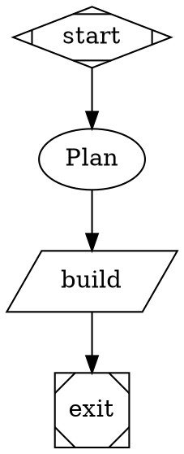

# Attractor

A BB plugin that runs **Graphviz DOT workflow definitions** (the StrongDM
Attractor dialect, plus the Fabro extensions that matter for a software
factory) with **BB threads as the agent backend**, and renders the
**workflow DAG with live execution state** (current node, visited path,
per-node status, visit counts, timing) inside BB chat and the thread side
panel.

See `docs/plans/2026-09-13-attractor-runner-plan.md` (in the main
repository) for the full design, the supported DOT dialect, the engine
contracts, and the task breakdown this plugin is built against.

## Authoring a graph

A workflow is a `digraph Name { ... }` (see "Supported DOT dialect" below for
the full grammar). Every graph needs exactly one start node and one exit
node; `dot/validate.ts` rejects anything else before a run is ever started.



Three worked examples live in `examples/`, each copied verbatim from the
plan's Appendix and exercised end to end in `tests/e2e.test.ts`:

- `examples/plan-implement-review.dot` — a plan/implement/test loop with a
  `model_stylesheet`, a human approval gate, `max_visits` loop caps, a
  goal-gated `command` (test) node, and a structured `output_schema="routing"`
  review stage.
- `examples/parallel-review.dot` — a `component` fan-out into three
  independent review lenses that converge on a `tripleoctagon` fan-in node.
- `examples/branch-loop.dot` — a `command` (build) node, a `diamond`
  conditional routing on the previous stage's outcome, and a graph-level
  `max_node_visits` bound so a persistently broken build terminates the run
  instead of looping forever.

A fourth, real-world graph is not from the plan and is not in the e2e
suite: `examples/dependency-updates.dot` applies this repo's outdated
dependencies one at a time (Codex triages and writes up; a Haiku worker
only edits `package.json` and runs `bun install`), verifying each with
`bun run typecheck && bun run test` in a `command` node, committing or
reverting in further `command` nodes (so an agent can neither batch nor
misreport — dogfood run 4 taught that lesson), writing the failures and
deferred majors up under `docs/dependency-upgrades/`, and opening a PR. It
shows a goal-gated baseline with a failure route to `exit`, a human gate
with a `review_target` and no timeout (it waits until answered), a loop
whose continuation routes on `command.output contains MORE|DONE` printed
by the sibling `dependency-updates.queue.mjs` helper, and a `command` node
that runs `gh pr create`.

Validate a graph without running it: `bb attractor validate <path>`.

### Dialect at a glance

| Shape | `type=` | Handler | Needs | Notes |
|---|---|---|---|---|
| `Mdiamond` | `start` | entry point | — | reserved ids `start`/`Start` also default to this |
| `Msquare` | `exit` | run termination | — | reserved ids `exit`/`Exit`/`end`/`End` also default to this |
| `box` (default) | `agent` | full-tool BB worker thread | `prompt` | model/provider/reasoning_effort from the node, the `model_stylesheet`, or the origin thread's defaults, in that order |
| `tab` | `prompt` | single-call worker thread | `prompt` | v1 is otherwise identical to `agent` — see "Deviations" |
| `parallelogram` | `command` | runs `script` on the environment's host via `host.ts` | `script` | writes `command.output`/`command.exit_code` |
| `hexagon` | `human` | asks a human to pick an outgoing edge, or free text on a `freeform=true` edge | — | see "Human gates" below |
| `diamond` | `conditional` | routes on the previous stage's outcome; no work of its own | — | see `context.last_outcome` |
| `component` | `parallel` | fans out over its outgoing edges | — | pairs with a `parallel.fan_in` node |
| `tripleoctagon` | `parallel.fan_in` | where fanned-out branches converge | — | branches write only to `parallel.results`/`parallel.branch_count`, never a top-level merge |

Graph attributes: `goal`, `rankdir`, `model_stylesheet`,
`default_permission_mode` (`accept-edits`\|`workspace-write`\|`auto`\|`full`\|`readonly`),
`default_max_retries`, `on_failure` (`route`\|`exit`\|`succeed`),
`retry_target`, `fallback_retry_target`, `max_node_visits` (`0` = unlimited).

Node attributes: `label`, `shape`/`type`, `class`, `prompt`, `script`,
`timeout`, `max_visits`, `max_retries`, `on_failure`, `retry_target`,
`fallback_retry_target`, `goal_gate`, `allow_partial`, `output_schema`
(`"routing"` or an inline JSON Schema string — only `"routing"` is actually
validated in v1), `model`, `provider`, `reasoning_effort`
(`low`\|`medium`\|`high`), `permission_mode`
(`accept-edits`\|`workspace-write`\|`auto`\|`full`\|`readonly` — resolved in
that order against the node's own attribute, then the graph's
`default_permission_mode`, then the origin thread's own default execution
permission mode; BB may still cap a spawned worker at the origin thread's
own permission ceiling regardless of what is requested here), `max_parallel`,
`question_type`, `join_policy` (`all`\|`any`\|`first` — v1 implements `all`),
`stdin_source`, `review_target` (a `human` gate's workspace-relative file
path to show alongside its question — see "Human gates" below; note this is
**not** Fabro's `review_target`, see "Deviations from the plan").

Edge attributes: `label`, `condition`, `weight` (int, default `0`),
`freeform` (human gates), `loop_restart` (parsed, ignored in v1).

Condition grammar (`dot/conditions.ts`):
`Key Op Value` or a bare `Key` (truthiness), joined with `&&`/`||`/`!`.
`Key` is `outcome`, `preferred_label`, or a `context.`-prefixed (or bare)
dot-path. `Op` is `= != > < >= <= contains matches`. `outcome` is one of
`succeeded`/`failed`/`partially_succeeded`/`skipped`.

Routing, after a stage completes, tries in order: (1) the outcome's
`jumpToNode`; (2) a conditional edge whose condition is true (highest
`weight`, then lexicographically smallest target); (3) `preferred_label`
matched against an edge's label (accelerator prefixes stripped); (4)
`suggested_next_ids`; (5) a failed outcome's effective `on_failure`; (6) an
unconditional edge; (7) the node's then the graph's `retry_target`/
`fallback_retry_target`, subject to the target's own `max_visits`; (8) no
next node — the run terminates with this node's outcome. See the plan's
"Supported DOT dialect" section for the exact algorithm.

### Human gates

A `hexagon` node's outgoing edges are its options — label them with an
optional accelerator prefix (`"[A] Approve"`, `"R) Revise"`, or
`"A - Approve"`); add `freeform=true` to an edge to also accept free text
(routed via that edge, bypassing the button options). A human answers a
blocked run either by clicking a button in the chat/panel surface, or from a
terminal: `bb attractor answer <runId> <label|text>`. A run blocked on a
gate reports status `blocked` until answered; a gate with a `timeout` and
nothing to answer falls back to the `human.default_choice` context key if
one is set (e.g. via `attractor_run`'s `inputs`), otherwise the stage fails
clearly rather than hanging forever.

A gate **without** a `timeout` waits until it is answered: `bb.ui.requestInput`
itself defaults to ten minutes and caps a single wait at one hour, so
`server/human.ts` asks in hour-long slices and re-issues the interaction
whenever a slice expires before the gate's own deadline (dogfood run 4 lost
its "Approve plan?" gate to that ten-minute default). And a gate that
*fails* — timed out with no usable default, cancelled — never routes down
one of its option edges: the router's step 6 (unconditional edges) is
skipped for a failed `human` node, so the run dead-ends on the gate's own
failure instead of silently "approving" (the same run had exactly that
happen before the fix). Route a failed gate explicitly with a
`condition="outcome=failed"` edge if the graph wants a fallback path.

**What the gate shows (2026-09-13 follow-up).** A human asked "Approve
plan?" can now see what plan: above the buttons, the renderer shows

- a **"Reviewing: `<path>`"** block when the node declares `review_target`
  (a workspace-relative path, e.g. `review_target="PLAN.md"`) — the file is
  read at gate-open time (`bb.sdk.files.read`, resolved against the run's
  environment the same way a workflow `path` is; a path that escapes the
  environment root or names a missing file shows an error there instead of
  failing the gate); rendered as Markdown for a `.md` path, or a wrapped
  monospace block otherwise — deliberately *not* a height-capped scrolling
  box, see "Scroll ownership" below;
- a collapsible **"Output of `<label>`"** block with the *previous* stage's
  response text (the context key `last_stage` at the time the gate opens,
  or the gate's single predecessor in the graph when that key is unset) —
  open by default when there's no `review_target` to show, collapsed
  otherwise;
- an **"Open thread"** button when that previous stage's worker thread is
  known, jumping straight to it.

This context is also on the `human.requested` event (a short summary:
node id/label/thread id, the reviewed path, and the first 200 characters of
each text), and `bb attractor stages`'/the run panel's stage table show
"reviewing `<path>`" for a blocked gate with a `review_target`.

### Worker prompts (blocked agent/prompt stages)

A worker thread inherits the origin thread's own permission mode/ceiling —
`permission_mode` (node) and `default_permission_mode` (graph) request a
mode, but BB may still cap a worker at whatever the origin thread already
allows. A worker that hits its own prompt mid-turn (a file-edit/command
approval, a plan confirmation, a provider question, or a plugin-rendered
one) stops there exactly like any other BB thread would — before this fix
the run just showed `running` forever with no visible reason (dogfood run
`411d2c5a`'s `implement` worker). Now that stage (and the run) reports
`blocked`, with a `waitingReason` naming the prompt's kind: the DAG renders
that node amber with a "Waiting: `<kind>` in worker thread" tooltip, and the
stage table shows "waiting: `<kind>`" next to an "Open thread" link.
Clicking the node or "Open thread" jumps a human into the worker thread to
answer the prompt directly; from a terminal instead:

```
bb thread interactions list <workerThreadId>
bb thread interactions approve <interactionId> <workerThreadId>   # or: grant
```

## Running a graph

**Agent tools** (registered for the origin thread only, via
`bb.agents.configure`):

- `attractor_run({ source | path, inputs?, title? })` — validates and
  persists a run, starts it in the background, and returns
  `{ runId, previewDirective }`. Emit `previewDirective` (a
  `::attractor-run{run="<runId>" thread="<threadId>"}` message directive,
  `threadId` being the run's origin thread) exactly once, on its
  own line, so the room sees a live card. The `thread` attribute means the
  directive can be pasted into (or forwarded to) any other thread and still
  resolve — see "Cross-thread cards" below.
- `attractor_inspect({ runId })` — the run's status and every stage's
  status/visit count/worker `threadId`.
- `attractor_result` — registered only for a spawned worker thread whose
  node declared `output_schema`; the worker must call it exactly once with
  the structured routing decision (see "Structured results" below).

**CLI** (`bb attractor …`, scoped to the calling thread's own runs):

```
bb attractor validate <path>              # lint a graph, no run
bb attractor run <path> [--input k=v]     # same as attractor_run, from argv
bb attractor status <runId>
bb attractor stages <runId>
bb attractor events <runId> [--since seq]
bb attractor stop <runId>
bb attractor answer <runId> <label|text>  # answer a blocked human gate
bb attractor --help                       # lists every command + summary
bb attractor <command> --help             # (or `help <command>`) usage + JSON output shape
```

Every `<runId>`-taking subcommand (`status`, `stages`, `events`, `stop`,
`answer`) exits `1` with `no such run: <runId>` on stderr for an unknown or
not-owned run id — it never silently prints `null`/`[]` with a `0` exit
code. `answer` also exits `1` (reason on stderr) when the run has no
pending human gate to answer; a mismatched label/text on a real pending
gate still exits `0` with `{ answered: false, reason }` (a legitimate "try
again" response, not an error). `stop` exits `1` with
`run <runId> is not running` when the run isn't in flight, and a
successful stop prints only `{ stopped: true, status: "cancelled" }`, not
the whole run.

**`--field <dot.path>`** (any command): prints just the value at that path
instead of the whole JSON object — a bare scalar with no surrounding quotes
(`bb attractor status <runId> --field status` prints `running`, not
`"running"`), an object/array as JSON. For a command whose result is itself
an array (`stages`, `events`) the path is applied to *each element*, one
line per element (`bb attractor stages <runId> --field nodeId` prints one
node id per line). An unknown path exits `1` with `no such field: <path>`
on stderr (for an array result, that's true when *any* element lacks it).

**RPC** (`server/contracts.ts`, consumed by `ui/*`/`app.tsx` via `useRpc`):
`getRun`, `listRuns`, `getGraph`, `getEvents`, `stopRun`, `activeRuns`,
`answerGate` — every method is scoped to the calling thread's own runs.

**Realtime**: the `attractor-runs` channel publishes `{ runId, threadId }`
on every event; `ui/run-panel.tsx`'s `RunPanel` and `ui/active-runs-
banner.tsx`'s `ActiveRunsBanner` both subscribe via `useRealtime` and
refetch.

**Directive / panel**: the `attractor-run` message directive
(`::attractor-run{run="<runId>" thread="<threadId>"}`) renders a header, the
DAG, and an expandable stage list inline in chat; "Open in right panel"
opens the same run in the thread side panel with the full DAG, stage list,
event timeline, and a Stop button.

### Active-runs composer banner

Every run still `running` or `blocked` for the thread you're typing into
shows as a row in a banner just above the composer — no need to have the
directive card pasted into (or still visible in) this thread to see a run
is still going. Registered from `app.tsx` via `app.composer.customize({
id: "attractor-status", scopes: ["thread"], banners: [{ id: "active-runs",
chrome: "bare", component: ActiveRunsBanner }] })`, the same shape BB's
own built-in Workflows plugin uses for its composer "active runs" strip.

Each row shows the run's title, coloured status word, `n/N stages`, and
live elapsed time; a chevron ("Open in right panel") opens the run in the
thread panel; an expand toggle reveals the same vertical DAG and stage
list the directive/panel show. A row blocked on a **human gate** (a
`hexagon` node) also renders its outgoing-edge options as inline answer
buttons — clicking one calls the `answerGate` RPC (the same resolution as
`bb attractor answer`/the `pendingInteraction` renderer, but stamped
`actor: "ui"`) and refreshes — plus a "Reviewing: `<path>`" hint when the
gate has a `review_target`, and an "Open thread" link when the routing
predecessor's worker thread is known. The banner fetches on mount, then
refetches on `attractor-runs` realtime events (coalesced like the panel)
and on a 5s fallback poll while any row is still active; a run drops off
the banner the instant it reaches a terminal status.

**Cross-thread cards.** The `thread` attribute names the run's *origin*
thread — every RPC call a card makes is scoped to it, not to whatever
thread happens to be hosting the card (`app.tsx`'s `Directive` uses
`attributes.thread?.trim() || message.threadId`, so a directive authored
before this attribute existed, or pasted by hand without it, still falls
back to its own hosting thread exactly as before). This means
`::attractor-run{run="<runId>" thread="<threadId>"}` — the exact text
`attractor_run`/`bb attractor run` return — can be copied into *any* thread
and still render the live card; ownership is unchanged (a card for a run
whose `thread` attribute doesn't actually match that run's origin thread
still renders "not found", the same as omitting the attribute against a
foreign run's id).

### Structured results (`output_schema="routing"`)

A stage whose prompt asks for a routing decision must call the
`attractor_result` tool exactly once with:

```json
{
  "outcome": "succeeded",
  "preferred_next_label": "Accept",
  "context_updates": { "reviewed": true }
}
```

`outcome` is required (`succeeded`, `failed`, or `partially_succeeded`);
`preferred_next_label`, `suggested_next_ids`, `failure_reason`, and
`context_updates` are optional. An invalid or missing report gets a
follow-up correction message in the same thread (up to twice) before the
stage is recorded as failed.

See `skills/attractor/SKILL.md` for the same material pitched at an
authoring/running agent.

## Status

Through the vertical Fabro-style run card restyle and dogfood-2 fixes (see
the section below). `examples/*.dot` holds the three worked graphs above;
`tests/e2e.test.ts` runs each of them through
the *real* engine and handler adapters (only the BB-facing dependencies —
an `AgentBackend`, a command `exec`, a `HumanInterviewer` — are scripted
fakes), asserting the visited node path, a plan/implement/review approve
*and* revise-then-approve loop, a three-way parallel fan-out/fan-in, and
both a build-loop success and a build that never turns green within
`max_node_visits`. The "Authoring a graph"/"Running a graph" sections above
are this task's README docs; `docs/plans/2026-09-13-attractor-runner-plan.md`'s
Status line is updated alongside this commit. A whole-branch review then
produced two blocking findings (worker tool gating, dispose behaviour) and
several minor ones; their fixes are recorded at the end of "Deviations from
the plan".

`handlers/human.ts` + `server/human.ts` + `ui/human-gate.tsx`
implement human gates end to end (see the T6 section below); `app.tsx`
registers the real `attractor-run` message directive and thread-panel
action, backed by the DAG/stage-list/event-timeline UI described below.
`server.ts` and `host.ts` are the T4 integration described below.
T2 adds the **DOT front-end** — parsing and validating workflow graphs, with
no execution yet:

- `dot/lexer.ts` — tokenizer (punctuation, quoted strings with escapes,
  `//` and `/* */` comments, bare words covering identifiers/numbers/durations).
- `dot/parser.ts` — token stream -> statement-list AST for
  `digraph Name { ... }` (graph/node/edge defaults, node statements, edge
  chains, subgraph blocks scoping `node[..]`/`edge[..]` defaults).
- `dot/graph.ts` — AST -> a typed `WorkflowGraph` (shape/`type=` -> handler
  kind, attribute typing incl. booleans/integers/durations/enums, node/edge
  default resolution, reserved `start`/`exit`/`end` id fallback).
- `dot/validate.ts` — lint rules producing `Diagnostic[]` (no/multiple
  start or exit nodes, unreachable nodes, edges to missing nodes, malformed
  conditions, agent/command nodes missing `prompt`/`script`, missing retry
  targets, conditions on `selection=random` nodes), plus defensive
  `invalid-enum-value`/`invalid-numeric-value` checks on `on_failure`,
  `reasoning_effort` and `max_visits`.
- `dot/conditions.ts` — the edge-condition grammar (`Expr`/`Or`/`And`/
  `Unary`/`Clause`), parser + evaluator, with numeric-vs-lexical comparison,
  `contains`/`matches`, and Fabro-style truthiness.
- `dot/stylesheet.ts` — `model_stylesheet` parser + CSS-like cascade
  resolver (`*` / shape / `.class` / `#id` specificity, last-rule-wins ties,
  explicit node attributes overriding the stylesheet).

All of `dot/` is pure (no BB imports, no I/O, no randomness) and is
exercised against the three Appendix example graphs and real Fabro job
graphs (see "Deviations from the plan" below) in
`tests/dot-integration.test.ts`.

T3 adds the **execution engine** (`engine/`), still entirely BB-free — it is
driven by fake handlers/clock/checkpoint sink in its own tests, and only
gets a real BB-thread backend in T4:

- `engine/types.ts` — the contracts from the plan's "Engine contracts"
  section (`Outcome`, `HandlerInput`, `Handler`, `HandlerRegistry`,
  `EngineOptions`, `RunResult`, `RunEvent`, `StageScopedEvent`), plus a
  `Checkpoint` shape (not fully specified by the plan; see "Deviations"
  below) and a `Context` interface backing `engine/context.ts`.
- `engine/context.ts` — a dot-path key-value context (`get`/`set` walk
  `"response.plan"` into nested objects, matching `dot/conditions.ts`'s own
  `context.<path>` resolution). Both directions guard against
  `Object.prototype` pollution: `get` only resolves *own* keys (so it never
  returns an inherited `Object.prototype` member like `constructor`), and
  `set`/`merge` refuse (throw) a path with a `__proto__`, `constructor` or
  `prototype` segment rather than writing through to the prototype chain.
  `merge()` dot-traverses each `context_updates` key the same way `set()`
  does — a key like `"build.status"` lands at `context.build.status`, not a
  literal top-level `"build.status"` key — so anything a handler merges in
  is readable the same way an edge `condition` reads it. `clone()`/
  `toObject()` give parallel-branch isolation and persistence, all with
  full deep-copy semantics.
- `engine/router.ts` — the next-node selection cascade (steps 1-6, plus
  `selectRetryTargetCandidates`/`selectRetryTarget` for step 7 and
  `isRetryEligible` for whether a null decision should consult it):
  `jump_to_node`, conditional edges (weight then lexical target tiebreak),
  `preferred_label` (with accelerator-prefix stripping on both sides,
  matched against *any* outgoing edge's label — including a conditional
  edge whose condition just evaluated false), `suggested_next_ids` (same,
  any edge), `on_failure` (`route`/`exit`/`succeed`, including `succeed`'s
  outcome rewrite-and-retry of steps 2-6), unconditional edges, and
  node-then-graph `retry_target`/`fallback_retry_target`.
  `selectRetryTargetCandidates` returns the *whole* existing-node cascade
  (not just its first entry) so the engine can apply `max_visits` to each
  candidate in turn — a visit-exhausted `retry_target` falls through to
  `fallback_retry_target` rather than ending the cascade. Step 7 is only
  ever consulted for a genuinely unresolved failure (or a chosen edge whose
  target turned out visit-exhausted) — never for a non-failed outcome that
  simply dead-ends, which instead terminates via step 8 with its own
  outcome; otherwise a graph-level `retry_target` on a node with no
  outgoing edges would route to itself forever once it succeeded.
- `engine/events.ts` — stamps a handler's narrow `StageScopedEvent` (`log`,
  `agent.thread`, `human.requested`/`human.answered`) into a fully-formed
  `RunEvent` (`runId`/`ts`/`stageId`/`nodeId`).
- `engine/engine.ts` — the walker: visit tracking and `max_visits`/
  `max_node_visits` gating (a non-enterable candidate is skipped and
  routing falls back to step 7 from the *completing* node, itself walking
  every candidate under the same `max_visits` gate), goal-gate evaluation
  at run termination (recorded for every visited node, including one
  executed inside a `parallel` branch — a branch node is a visited node),
  retries with fixed 1s/2s/4s delays via an injected clock (only for a
  thrown handler error — a returned `Outcome{status:"failed"}` is a
  business outcome that goes through the normal `on_failure` cascade, not
  the retry loop; T4 revisits this once the real command handler maps a
  process exit code to an outcome), `parallel`/`parallel.fan_in` fan-out
  with per-branch context clones, a fork node's `max_parallel` bounding how
  many branches run concurrently (unset/0 = unbounded), and
  `parallel.results`/`parallel.branch_count` written to the parent context
  only (never a top-level branch merge) — each `parallel.results` entry is
  `{ id, index, status, context_updates?, text? }`, `text` being the
  branch's own last-stage outcome text in full (dogfood-2 fix: a fan-in/
  digest stage could previously only see each branch's status, not what it
  actually said; `server/backend.ts`'s `assemblePrompt` renders a non-empty
  `parallel.results` as a `Parallel results (N):` prompt section, one bullet
  per branch, right after `Prior stages:`), checkpoint saves after every
  non-terminal stage, checkpoint-driven resume, and cancellation via
  `AbortSignal`. Event `stageId`s carry `<nodeId>@<visit>#<attempt>` for
  `stage.started`/`stage.completed`/`stage.failed`; the identity form
  `<nodeId>@<visit>` (no attempt) is what handlers, the checkpoint sink and
  `stage.skipped` see, per the plan's "`#<attempt>` only in events, never
  as identity".

All of `engine/` is pure (no BB imports, no timers of its own, no
randomness — the clock and checkpoint sink are injected) and is exercised
with fake handlers only; `tests/engine.test.ts` includes a full recorded
event-sequence walk of the Appendix's `PlanImplementReview` example (a plan
revision loop, a failing-then-passing test node, and a routing-JSON review
node) as its integration-level check.

T4 adds the **BB integration** — the plugin actually runs a graph now:

- `server/backend.ts` — the BB-thread `CodergenBackend`: spawns a hidden
  worker thread per `agent`/`prompt` stage (reusing the origin thread's
  environment), resolves its model/provider/reasoning_effort tuple
  (`model_stylesheet`, then explicit node attributes, then the origin
  thread's own provider/defaults — validated against the live
  `bb.sdk.providers.models` catalog, never silently substituted), and waits
  for `thread.idle`/`thread.failed`/`thread.deleted` (registering its three
  `bb.events.on` listeners exactly once, since the SDK has no unsubscribe,
  and dispatching by threadId through an internal map — a fast/replayed
  completion is also reconciled immediately via `bb.sdk.threads.get`
  without waiting for the event). A `thread.failed`/`thread.deleted`
  completion **throws**, which is deliberate: engine.ts's own
  `max_retries` machinery only retries a *thrown* handler error, never a
  returned business `Outcome`, so a dead worker thread is exactly the
  "infra fault" that mechanism is for (see T3's README note it flagged as
  needing T4 to settle). For an `output_schema` node, the worker must call
  the `attractor_result` tool; an invalid or missing report gets up to two
  corrective re-prompts of the same thread (`bb.sdk.threads.send`) before
  the stage is recorded failed. Every wait also races `input.signal`: `bb
  attractor stop`/`stopRun` aborts the engine's per-run `AbortController`,
  which the backend observes by calling `bb.sdk.threads.stop` on the live
  worker thread and settling the stage as cancelled — without this, a run
  parked on an agent/prompt stage could never actually be stopped, since
  nothing else was watching the signal. Once a stage settles (however it
  settles), its worker thread is archived (`bb.sdk.threads.archive`),
  best-effort, so a plugin doesn't accumulate a hidden thread per stage for
  the life of the project.
- `handlers/agent.ts` / `handlers/prompt.ts` — thin adapters from the
  engine's `Handler` shape onto `AgentBackend.run`, carrying the per-run
  threadId/projectId/environmentId the backend needs. `prompt` (the `tab`
  shape's "single LLM call, read-only tools") is otherwise identical to
  `agent` in v1 — see "Deviations" below.
- `handlers/command.ts` — runs a node's `script` through an injected `exec`
  dependency (wired to the real `host.ts` RPC in `server/service.ts`) and
  maps its exit code/timeout to an Outcome, writing `command.output` /
  `command.exit_code` to context per the dialect's context-keys list.
- `handlers/conditional.ts` — a `diamond` node has no prompt/script of its
  own; it mirrors the *previous* stage's outcome status via a new
  `context.last_outcome` key engine.ts now writes after every stage (not in
  the plan's literal context-keys list — see "Deviations" below), which is
  what lets the Appendix's BranchLoop `check` node's own
  `condition="outcome=succeeded|failed"` edges mean anything.
- `handlers/parallel.ts` / `handlers/start-exit.ts` — trivial always-succeed
  handlers for `parallel`/`parallel.fan_in`/`start`/`exit`: engine.ts itself
  already does the fan-out/fan-in and goal-gate/termination bookkeeping
  around these nodes' own stage.
- `host.ts` / `host-contract.ts` — the real `exec` host RPC: runs `script`
  via `/bin/sh -c` in a detached process group (so a timeout/abort can kill
  a build tool's own children, not just the shell), `cwd` = the
  environment's path, `ATTRACTOR_RUN_ID`/`ATTRACTOR_NODE_ID` env, optional
  stdin, and stdout/stderr bounded to the last 64 KiB (tail, not head).
  The service passes the node's `timeout` (default 2 min, capped at the
  contract's 30 min) as the script's own kill timer **and**, plus a 5 s
  grace, as the host RPC call's `timeoutMs` — the SDK's default host-call
  deadline is 30 s, which is what killed dogfood run 4's
  `bun install && typecheck && test` baseline stage ("host plugin call …
  exceeded its deadline") before this was wired through.
- `server/store.ts` — a `better-sqlite3`-backed `RunStore` (runs, stages,
  events; append-only migrations, matching `bb-plugin-assembly-lines`'s
  `JobStore` shape), taking the `Database.Database` handle directly so it
  is unit-testable without a fake `bb`.
- `server/service.ts` — run lifecycle: validates and persists a run,
  starts it in the background (`runEngine` with the real handler
  registry), persists every event/stage transition and checkpoint,
  publishes `bb.realtime` on the `attractor-runs` channel, and resumes
  every `running` run from its last checkpoint (`resumeRunningRuns`,
  called by the `attractor-runs` background service on load — this is how
  a run survives a plugin restart). `resolveWorkflowPath` resolves a
  `path` input relative to the origin thread's environment root and
  rejects any traversal outside it.
- `server/contracts.ts` — the `getRun`/`listRuns`/`getGraph`/`getEvents`
  RPC contract; every read is scoped to the calling thread's own runs.
- `server.ts` — wires all of the above: the `attractor_run` /
  `attractor_inspect` / `attractor_result` agent tools, `bb agents.configure`
  gating (a spawned worker thread gets only `attractor_result` when its
  node needs a structured result, otherwise no plugin tools at all; the
  origin thread gets `attractor_run`/`attractor_inspect` + the `attractor`
  skill), the `bb attractor validate|run|status|stages|events|stop` CLI,
  and the `attractor-runs` background service.

`tests/server/backend.test.ts`, `tests/server/service.test.ts` and
`tests/server/server.test.ts` exercise this against
`@get-bb/plugin-sdk/testing`'s `createFakePluginHost` (spawn args, idle →
output → outcome, a failed thread retrying, structured-result
validation/retry, path-traversal rejection, directive text, RPC ownership
scoping, and resuming a run stuck "running" across a simulated reload);
`tests/host.test.ts` exercises the real `exec` host entry via
`experimental_createHostEntryHarness` (exit code, stdin, timeout/kill,
output bounding); `tests/handlers/*` and `tests/server/store.test.ts` cover
the rest with plain fakes.

T5 adds the **DAG UI**:

- `ui/dag.tsx` — a pure `layoutGraph()` (dagre; `direction` defaults to
  "TB", regardless of the graph's own `rankdir` — see the restyle section
  below) plus `DagView`, an SVG rendering with a live execution overlay:
  shape hints per `handlerKind` (ellipse for agent/prompt, and a distinct
  outline for every other kind — start/exit/human/command/conditional/
  parallel), status colour (`pending`/`running`/`succeeded`/`failed`/`skipped`/`blocked`), a
  visit-count badge once `visit > 1`, the run's current node highlighted,
  and traversed edges (derived from `edge.selected` events, not persisted
  per-edge state) drawn solid/arrowed with the last-selected reason and
  label in a `<title>`; an agent/prompt node with a known worker thread is
  clickable, in all three surfaces (directive card, panel, composer banner —
  `ui/thread-by-node.ts`'s `latestThreadIdByNode(stages)` is the one nodeId
  -> threadId derivation shared by all three, so a fix to it, or to the
  affordance below, always reaches all three at once). A clickable node
  carries a visible affordance so it doesn't just look like every other
  node: a `.attractor-node--clickable` CSS class (hover/focus gets a
  thicker stroke and a subtle blue glow, purely via CSS `:hover`/`:focus` —
  no JS hover state), an underlined label, a small "↗" glyph, and a
  `<title>Open worker thread <id></title>` tooltip — a non-clickable node
  gets none of these. `DagView` also overlays a small zoom control cluster
  (+/−/fit, top-right of the box) — zoom applies a scale/translate on one
  inner `<g data-testid="dag-zoom-group">` around the edges and nodes,
  clamped to `[0.5, 4]`; "fit" resets to exactly the default fit-to-width
  transform. Ctrl/⌘+wheel over the DAG also zooms (a manual, non-passive
  native `wheel` listener — a synthetic React `onWheel` handler cannot
  reliably `preventDefault()` — so pinch-zoom and an explicit ctrl+wheel
  both work); a *plain* wheel is left completely alone (no
  `preventDefault()`, no zoom) so the thread/panel underneath keeps
  scrolling normally, per "Scroll ownership" below. Once zoomed in, drag
  with a pointer to pan (`pointerdown`/`pointermove`/`pointerup`,
  `setPointerCapture`). The DAG box wrapper (`data-testid="dag-viewport"`)
  is `overflow: hidden`, never `overflow: auto` — the same scroll-ownership
  rule as the rest of the card.
- `ui/stages.tsx` — the stage list: four columns (Node, Status, Duration,
  Thread), `table-layout: fixed` with wrapping cells, so it fits inside the
  message-directive card's `max-w-md` (28rem) without spilling sideways —
  it used to be six columns (Node, Status, Visit, Duration, Provider,
  Thread), which didn't. `Visit` folds into the Node column as a "×N"
  suffix (only when `visit > 1`); the node's resolved-or-declared
  provider/model (`formatDuration` for elapsed/fixed duration, as before)
  renders as muted subtext under the node's name instead of its own
  column. An "Open thread" link still appears in the Thread column when a
  stage has a worker thread. The same four-column layout is used in both
  the card and the wider panel — no separate `overflow-x: auto` wrapper is
  needed at either width.
- `ui/events.tsx` — a paged (`PAGE_SIZE = 50`), oldest-first-within-page
  event timeline starting on the most recent page, with a one-line
  `describeEvent` summary per `RunEvent` variant.
- `ui/run-panel.tsx` — `RunPanel`, the data-fetching component shared by
  both surfaces: `getRun`/`getGraph`/`getEvents` on mount, refetch on any
  `attractor-runs` realtime signal (or one naming this run), a header
  (title, status, elapsed, *visited*/total stages), and mode-specific
  layout (`"directive"`: DAG + expandable stage list + "Open in right
  panel"; `"panel"`: DAG + stage list + event timeline + a Stop button
  while the run is active, inside a `h-full min-h-0 overflow-y-auto`
  root — see "Scroll ownership" below).

#### Scroll ownership

Two rules, enforced by `tests/ui/scroll.test.tsx`:

- **The chat and composer surfaces own no scrolling.** The message
  directive, the human-gate `pendingInteraction` and the active-runs
  composer banner all render inside containers BB scrolls (the thread
  timeline, the composer stack). A bounded vertical scroll container
  anywhere inside them — a `max-height` plus `overflow: auto`, as the
  gate's review-target `<pre>` used to have — sits under the pointer and
  swallows the wheel, so the *thread* stops scrolling while the pointer is
  over the card. (`overflow: hidden`, `overflow-x: auto`, and an inner
  scroller already at its end all chain to the host normally; only a
  bounded, still-scrollable vertical box traps it.) Long content flows
  instead, and the host scrolls it.
- **The flush thread panel owns all of its scrolling.** `app.tsx`
  registers the panel action with `layout: "flush"`, which the SDK defines
  as "the full tab area (no padding, definite height, no host scrolling)".
  The panel root is therefore `flex h-full min-h-0 flex-col overflow-y-auto
  p-3` — without it the pane's own definite height simply clips the stage
  table and event log with nothing able to scroll to them.
- `app.tsx` — registers the `attractor-run` `messageDirective` (renders
  `RunPanel` in `"directive"` mode, or an error when the directive's `run`
  attribute is missing/blank) and the matching `threadPanelAction`
  (`"panel"` mode, reading `runId` from the tab's `params`).

`ui/*` and `app.tsx` only ever import from `server/contracts.ts` (zod
schemas + their inferred TS types) and `engine/types.ts` (the pure
`RunEvent` union) — never `server/service.ts` or `server/store.ts`, which
pull in `better-sqlite3`, a native module that must never end up in the
app's esbuild bundle (`bb plugin build .`'s `dist/app.js` is ~60 KB with
zero references to it, vs. `dist/server.js`'s ~850 KB).

`tests/ui/dag.test.ts` covers `layoutGraph` directly (deterministic,
node-environment, no DOM); `tests/ui/dag.render.test.tsx`,
`tests/ui/stages.test.tsx` and `tests/ui/events.test.tsx` cover their
respective components under jsdom; `tests/app.test.tsx` exercises the
directive and panel end-to-end through `@get-bb/plugin-sdk/testing/app`'s
`loadPluginApp`/`renderSlot` against a fake RPC (invalid/blank run id,
node/status rendering, "Open in right panel", the Stop button, realtime
refetch, and error/not-found states).

T6 adds **human gates** — the `hexagon` handler, end to end:

- `handlers/human.ts` — builds the option list from `gate`'s outgoing edges
  (`parseAcceleratorLabel` reads a `"[K] label"` / `"K) label"` / `"K - label"`
  prefix into `{ key, text }`; edges with no `condition` and just a `label`
  are the choices), marks `freeform: true` when any outgoing edge declares
  `freeform=true`, and asks an injected `HumanInterviewer` — the same
  injection-seam pattern as `handlers/agent.ts`'s `AgentBackend`, so `engine/`
  stays BB-free and this handler is unit-tested with a fake interviewer (and
  exercised through the real engine in `tests/engine.test.ts`'s "human gate
  routing" block). A chosen option's raw edge label becomes the outcome's
  `preferredLabel`, so the existing routing cascade (step 3) takes it to the
  matching edge — no new routing logic needed. A free-text answer instead
  carries no edge label to match, so it sets the outcome's `jumpToNode`
  directly to the graph's `freeform=true` edge's target (cascade step 1),
  bypassing steps 2-6 entirely — without this, a free-text answer would
  fall through to step 6 and silently take one of the gate's *button* edges
  instead (validation finding, T6 round 2 — see "engine: human gate
  routing" > "routes free text along the freeform edge" in
  `tests/engine.test.ts`). Context keys written exactly
  per the plan: `human.gate.selected`, `human.gate.label` (button choices
  only), `human.gate.text` (freeform only), `human.gate.<node>.answer` /
  `.label` — `dot/validate.ts` flags a gate node id of
  `selected`/`label`/`text` as `human-gate-reserved-id` (round 2: those ids
  collide with the fixed keys above, silently clobbering one write with the
  other) and a gate with neither a labeled edge nor a `freeform` edge as
  `human-gate-no-options` (round 2: such a gate could previously only ever
  be cancelled). A user cancel, an unanswered timeout with nothing to fall
  back to, or a timed-out gate whose `human.default_choice` names no
  outgoing edge label (round 2 — previously a typo'd default choice still
  returned a bogus `succeeded`/`preferredLabel` that fell through to step 6
  and took an arbitrary unconditional edge) fails the stage clearly (never
  hangs) — and, since there's no answer to
  drive `respondWithChoice`'s own `human.answered` emit, all three failure
  branches emit
  a bare `human.answered` (no `answer`) themselves, so `applyEventToStore`
  still clears the transient `blocked` run/stage status before the routing
  cascade carries the run on through the failed gate's outgoing edges.
- `server/human.ts` — the real `HumanInterviewer`, via `bb.ui.requestInput`
  (`rendererId: "attractor-human-gate"`, from `server/contracts.ts`'s
  `HUMAN_GATE_RENDERER_ID`). Maps `requestInput`'s cancellation reasons:
  `"timeout"` → `{ kind: "timeout" }`, `"user"` (the pendingInteraction's own
  Cancel button) → `{ kind: "cancelled" }`, anything else (in particular
  `"request-aborted"`, exactly what the Stop button's `AbortSignal` produces)
  → a thrown error, so the engine treats a Stop the same way it does for an
  in-flight agent stage rather than quietly recording a declined gate.
- `server/service.ts` — wires `createHumanHandler` into the handler
  registry (an optional `humanInterviewer` dependency, defaulting to one
  that fails clearly, so every pre-T6 test that never reaches a human node
  is unaffected); `applyEventToStore` sets both the stage and the run's
  `status` to a new `"blocked"` value on `human.requested`, back to
  `"running"` on `human.answered` — never a terminal status, `recordFinish`
  always overwrites it once the run actually ends. `listRunningRunIds` now
  also picks up `"blocked"` runs so a plugin restart while a gate is waiting
  doesn't strand the run (it simply re-asks on resume, from its last
  checkpoint before the gate). `answerHumanGate(runId, answer)` backs `bb
  attractor answer` — see "Deviations" below for how it resolves a live
  `bb.ui.requestInput` interaction from outside the app's own renderer.
- `ui/human-gate.tsx` — the `pendingInteraction` renderer: one button per
  option (`[key] text`), a free-text field + Submit when the payload's
  `freeform` is true, and a Cancel button. Reads/writes the `HumanGate*`
  zod schemas in `server/contracts.ts` (payload in, `HumanGateValue` out via
  `submit()`), registered in `app.tsx` under `HUMAN_GATE_RENDERER_ID`.
- `ui/dag.tsx` gets a `"blocked"` status colour (amber) and `ui/run-panel.tsx`
  treats `"blocked"` like `"running"` for the elapsed-time ticker and the
  Stop button (a human gate can still be aborted).
- CLI: `bb attractor answer <runId> <label|text>` — matches `answer` against
  an option's raw label, its accelerator-stripped text, or its accelerator
  key (case-insensitively), falling back to free text only when the gate's
  `freeform` allows it; scoped to the run's owning thread like every other
  runId subcommand.

`tests/handlers/human.test.ts` unit-tests the handler against a fake
interviewer (options built from edges, accelerator parsing, context keys,
freeform, timeout with/without `human.default_choice`, cancellation);
`tests/engine.test.ts`'s "human gate routing" block runs it through the
real engine; `tests/server/human.test.ts` exercises the real
`bb.ui.requestInput`-backed interviewer against
`@get-bb/plugin-sdk/testing`'s fake host (the request carries the edge
options, a submitted choice/text/cancel/abort maps correctly, a malformed
or unknown submitted value is rejected rather than guessed); `tests/server/
service.test.ts` covers the run/stage `"blocked"`↔`"running"` transition and
`answerHumanGate`'s matching/ownership logic; `tests/server/server.test.ts`
adds full end-to-end coverage of `bb attractor answer` against a real
`attractor_run` (see "Deviations" below on how that test bridges the fake
host's two otherwise-disconnected interaction mechanisms); `tests/ui/
human-gate.test.tsx` covers the renderer (buttons per option, freeform
field, Cancel, invalid-payload fallback) and `tests/app.test.tsx` adds its
registration + a smoke render.

T7 adds the worked examples and end-to-end tests:

- `examples/plan-implement-review.dot`, `examples/parallel-review.dot`,
  `examples/branch-loop.dot` — the plan's three Appendix graphs, copied
  verbatim (see "Authoring a graph" above for what each one exercises).
- `tests/e2e.test.ts` — wires the *real* handler adapters
  (`handlers/agent.ts`/`prompt.ts`/`command.ts`/`conditional.ts`/
  `parallel.ts`/`start-exit.ts`/`human.ts`) to scripted fakes for the three
  BB-facing injection seams (`AgentBackend`, a command `exec` function, a
  `HumanInterviewer`) and runs each example through the real
  `dot/graph.ts` parser and `engine/engine.ts` walker, asserting the
  visited node path from the recorded `RunEvent`s. Unlike
  `tests/engine.test.ts` (trivial always-succeed fake `Handler`s), this is
  the first test to exercise the actual handler-adapter wiring
  `server/service.ts` assembles for a live run, end to end and BB-free.
  Five cases: PlanImplementReview's happy path and its
  approve/revise-then-approve loop; ParallelReview's three-way fan-out/
  fan-in (asserting `parallel.branch_count`/`parallel.results`, and the
  branch node ids as a set since branches may interleave); BranchLoop's
  build-fails-then-succeeds loop and a build that never turns green within
  `max_node_visits` (asserting the run fails its goal gate and the loop is
  actually bounded, not infinite).
- README's "Authoring a graph"/"Running a graph" sections (dialect table,
  routing cascade summary, human gates, CLI/tool/RPC/directive reference,
  structured-result contract) — this task's docs deliverable, distinct from
  `skills/attractor/SKILL.md`'s agent-facing version of the same material.
- `docs/plans/2026-09-13-attractor-runner-plan.md`'s Status line, updated
  to reflect all seven tasks landed.

## Vertical Fabro-style run card restyle + dogfood-2 fixes

A second dogfood run (`411d2c5a-149b-49d8-b727-9d28acae3976`) drove two
changes: a restyle of the run card to match a reference Fabro-style
screenshot, and three real plugin gaps the run itself exposed.

**Restyle** (`ui/dag.tsx`, `ui/run-panel.tsx`, `ui/stages.tsx`, `app.tsx`):

- `ui/dag.tsx`'s `layoutGraph(graph, direction?)` takes an explicit
  `direction` ("TB" | "LR"), **defaulting to "TB"** — the card always
  renders top-to-bottom regardless of the DOT graph's own `rankdir`, which
  stays parsed and exposed on `GraphView` but is no longer consulted for
  layout. `DagView` takes the same `direction` prop (also defaulting to
  "TB"). The two-pass back-edge weighting is unchanged; only which axis
  ranks land on changed.
- Node shapes now read like actual Graphviz output: `agent`/`prompt` are
  ellipses (previously a plain rounded rect, indistinguishable from `exit`'s
  old rect too), `command` stays a parallelogram, `human` a hexagon,
  `conditional` a diamond, `parallel`/`parallel.fan_in` an octagon,
  `start`/`exit` the existing Mdiamond/Msquare. Node width now follows its
  label (~7.5px/char + 28px padding, clamped 88–240px) instead of a fixed
  168px, and height is a fixed 40px (was 52px) — both fed into `layoutGraph`
  itself so spacing accounts for real sizes, not just the SVG rendering.
  Status fill/stroke: `succeeded` #dcfce7/#16a34a, `running` #dbeafe/#2563eb
  (2.5px stroke), `blocked` #fef3c7/#d97706, `failed` #fee2e2/#dc2626,
  `skipped` #f5f5f4/#a8a29e, `cancelled` #f5f5f4/#a8a29e (the stage a run
  was stopped in; settled by the finish path, since the engine emits no
  stage event for an aborted stage), `pending` #ffffff/#94a3b8 (hollow).
- Edges render as a smoothed spline (`pathFor`'s `Q`-command
  midpoint-smoothing between consecutive dagre-routed points) rather than a
  sharp polyline; stroke #94a3b8/1.25px untraversed (matching the pending
  node's hollow outline), #2563eb/2px traversed, an untraversed back edge
  may still dash. An edge's on-diagram label lost its white background rect
  in favour of a `paint-order="stroke"` white text-stroke halo (`stroke="#fff"`,
  `strokeWidth 3`) — legible over a crossing line/node without a boxy
  background; the `<title>` tooltip is unchanged.
- The card itself (`ui/run-panel.tsx`'s new `RunCard`, shared by both
  surfaces): a dark BB card (`rounded-lg border border-border bg-card p-3
  shadow-sm`, `max-w-md` only in directive mode) with a header (workflow
  icon + bold title + a chevron button, `aria-label="Open in right panel"`,
  directive-only), a status row (status word coloured by
  `running`/`blocked` → amber, `succeeded` → green, `failed` → destructive,
  `cancelled` → muted, plus the run id's first 8 characters in monospace),
  a summary line (`Stages: n/N · Elapsed: <duration>`, plus `· Waiting:
  <node label>` while blocked), the DAG inside a white rounded box, and a
  status-colour legend row. The directive's "Show stages" toggle moved to
  its own footer button, now that "Open in right panel" lives in the
  header.

**Dogfood-2 fixes:**

1. **Worker approval prompts are invisible (`server/backend.ts`,
   `server/service.ts`, `server/store.ts`, `engine/types.ts`,
   `engine/events.ts`, `ui/*`).** In run `411d2c5a` the `implement` worker
   (a hidden thread) stopped on a file-edit approval; the run showed
   `running` forever with nothing pointing at why. `server/backend.ts` now
   subscribes once to `bb.events.on("interaction.pending", ...)`: when the
   interacting thread is a worker this backend spawned (`workerThreads`, or
   `thread.originPluginId === bb.pluginId`), it looks up that worker's
   *live stage's* `emit` — remembered per worker thread id in
   `emitByWorkerThread` (set alongside `workerThreads.add` in `run()`,
   deleted in the same `finally`, precisely so an event delivered outside
   `run()`'s own await can still reach the right stage) — and emits a new
   `agent.waiting` event (`threadId`, `interactionId`, `kind`, `title`).
   `kind` is the plugin-origin interaction's own `rendererId` when
   `payload.kind === "plugin"`, else the provider interaction's own
   `payload.kind` (e.g. `"approval"`, `"user_question"`, or a provider's own
   `"<namespace>/<name>"` kind). When that worker next fires `thread.active`
   or `thread.idle`, a new `agent.resumed` event clears it — guarded by a
   `waitingWorkers` set so an ordinary (never-blocked) worker's own idle
   transition never emits a spurious "resumed". `engine/types.ts` gained
   both events (`StageScopedEvent` + a fully-stamped `RunEvent` form
   carrying `runId`/`ts`/`stageId`/`nodeId`), and `engine/events.ts`'s
   `createStageEmitter` stamps them the same way it already does
   `agent.thread`. `server/service.ts`'s `applyEventToStore` mirrors the
   existing `human.requested`/`human.answered` handling: `agent.waiting`
   sets the stage `blocked` and persists its `waitingReason` (`kind`) via a
   new nullable `attractor_stages.waiting_reason` column (same idempotent
   `PRAGMA table_info` + `ALTER TABLE` pattern as `provider_id`/`actor`),
   and sets the run `blocked`; `agent.resumed` clears both, but only
   restores the run to `running` if no *other* stage is still blocked
   (another `agent.waiting`, or an unrelated human gate). `bb attractor
   stages` includes `waitingReason`. UI: a blocked agent/prompt node
   renders amber with a `"Waiting: <kind> in worker thread"` tooltip (only
   when `waitingReason` is set — a human-gate `blocked` node has none and
   stays untitled); the stage table shows `"blocked (waiting: <kind>)"`
   next to the existing "Open thread" link; the card's summary line already
   covers this generically via `"· Waiting: <label>"` (any blocked stage,
   human gate or worker prompt alike). README/SKILL.md document that a
   worker inherits the origin thread's permission mode/ceiling, that
   `blocked` can mean a worker's own pending prompt, and that
   `bb thread interactions list <workerThreadId>` then `bb thread
   interactions approve|grant <interactionId> <workerThreadId>` unblocks it
   from a terminal. Tests: `tests/events.test.ts` (stamping),
   `tests/server/store.test.ts` (the column + accessor),
   `tests/server/service.test.ts` (`applyEventToStore`'s blocked/cleared
   transitions), `tests/server/server.test.ts` (end to end against
   `createFakePluginHost` — `host.harness.behavior.emitThreadEvent(
   "interaction.pending", { thread, interaction })`, matching the existing
   `"thread.idle"` emission pattern; a non-worker thread's interaction is
   ignored), `tests/ui/dag.render.test.tsx` and `tests/ui/stages.test.tsx`.

2. **`permission_mode` node/graph attribute (`dot/graph.ts`,
   `dot/validate.ts`, `server/backend.ts`).** `permission_mode` (node) and
   `default_permission_mode` (graph) accept `accept-edits` |
   `workspace-write` | `auto` | `full` | `readonly`; `dot/validate.ts`
   flags any other value as `invalid-enum-value`, the same pattern as
   `reasoning_effort`/`on_failure`. `resolveModelTuple` resolves it in the
   same order as model/provider/reasoning_effort: the node's own attribute,
   then the graph's default, then the origin thread's own default
   execution permission mode. **Deviation:** BB's own `bb.sdk.threads.spawn`
   (and `defaultExecutionOptions`) permission-mode vocabulary is only three
   values — `accept-edits` | `auto` | `full` — the dialect's other two
   values don't exist in BB at all. `resolveModelTuple` maps
   `workspace-write` → `accept-edits` (both auto-approve file edits) and
   `readonly` → `auto` (BB's most conservative real mode — it still prompts
   before anything a more permissive mode would auto-approve, the closest
   available approximation of "never write silently") before ever reaching
   `spawn`, whose own zod schema would otherwise reject an unrecognised
   literal outright. Tests: `dot/graph.ts` typing + parsing,
   `dot/validate.ts`'s enum check, and `server/backend.ts`'s spawn-args
   tests (including the two-value mapping).

3. **Parallel branch results carried no text (`engine/engine.ts`,
   `server/backend.ts`).** `runParallelFanOut`'s `runBranch` result gained a
   `text` field (the branch's own last-stage outcome text, in full) —
   documented above under "Context keys". `server/backend.ts`'s
   `assemblePrompt` renders a non-empty `context.parallel.results` as a
   `Parallel results (N):` section right after `Prior stages:`, one bullet
   per branch (`- <id> | <status>: <text preview>`, truncated the same way
   as a prior stage's response). Tests: `tests/engine.test.ts`'s new
   parallel-results-carry-text case, and `tests/server/backend.test.ts`'s
   prompt-assembly tests for the section (present, ordered after "Prior
   stages:", truncated, and omitted when there is nothing to show).

## Development

From this directory:

```sh
npm --cache "$PWD/.local/npm-cache" install
npm --cache "$PWD/.local/npm-cache" run typecheck
npm --cache "$PWD/.local/npm-cache" test
bb plugin build .
```

`.local/` (the npm cache override) is gitignored, along with `dist/` and
`node_modules/`.

## Deviations from the plan

- **T2 acceptance criteria says "the three Fabro graphs stored in
  `~/.bb/plugins/assembly-lines/host-data/jobs/*/workflow.json`".** At the
  time this task ran, that directory held four job directories, but only
  **two** distinct `workflow.fabro` texts among them — the other two are
  byte-for-byte duplicates (same SHA-256 of the DOT text). Both distinct
  graphs are copied into `tests/fixtures/fabro-graphs.ts` and exercised in
  `tests/dot-integration.test.ts`; there was no third distinct graph to
  include.

- **The `edge-missing-target`/`edge-missing-source` validate rules are not
  reachable from real, authored DOT source.** `dot/graph.ts`'s statement
  walker auto-creates a node for every id mentioned in an edge chain (so
  `a -> ghost` always yields a node named `ghost`, which then falls through
  to `handler-missing-prompt` etc. instead), so a graph parsed from DOT text
  can never actually have an edge pointing at a genuinely missing node. The
  rules are still real defensive coverage — they protect `validate()` against
  any future caller that builds a `WorkflowGraph` by hand instead of via
  `parseWorkflowGraph` — and `tests/validate.test.ts` exercises them the same
  way, by pushing a synthetic edge onto an already-built graph object rather
  than parsing DOT text.

- **Graph-scope `key=value;` statements (no `graph [..]` wrapper) are not
  supported.** Idiomatic Graphviz allows a bare assignment at the top of a
  graph body, e.g. `rankdir=LR;`, as shorthand for `graph [rankdir=LR];`.
  The plan's dialect list only names the `graph [..]` form, so this parser
  treats a bare `key=value` graph-scope statement as a syntax error rather
  than a graph attribute. Prefer `graph [key=value, ...]` when authoring.

- **`Checkpoint` (T3).** The plan's engine contracts snippet references
  `checkpoint?: { save(state: Checkpoint): Promise<void>; load?: Checkpoint }`
  but never defines `Checkpoint` itself. `engine/types.ts` defines it as
  `{ runId, nextNodeId, context, visitCounts, goalGateOutcomes }` — enough
  state that loading one and resuming needs to replay nothing before
  `nextNodeId` (verified in `tests/engine.test.ts`). `server/store.ts` (T4)
  is expected to persist this shape; if that task finds it insufficient
  (e.g. for resuming mid-parallel-fan-out — see below), it should extend
  rather than replace it.

- **Checkpoint granularity vs. `parallel` fan-out (T3).** A checkpoint is
  only saved at points in the *main* walk (after a non-parallel stage
  picks its next node, and once after a whole `parallel`/`parallel.fan_in`
  group has converged), not after each individual parallel branch stage.
  Resuming mid-fan-out therefore re-runs the whole group rather than only
  the branches that hadn't finished. This wasn't in the acceptance
  criteria (which only requires "checkpoint save after every stage" and a
  resume test with a linear graph, both of which pass) and finer-grained
  parallel checkpointing did not seem worth the added complexity for v1.

- **Retry vs. `on_failure` (T3).** "Retries: `max_retries` per node with
  fixed 1s/2s/4s delays" is separate machinery from the `on_failure`
  routing cascade. This implementation treats them as covering different
  failure sources: `max_retries` retries a **thrown handler error** (e.g.
  an infra/network fault) in place, re-running the same stage; a handler
  that *returns* `Outcome{status:"failed"}` is a normal business outcome
  that is never retried in place — it goes straight through the
  `on_failure` cascade (`route`/`exit`/`succeed`) like any other outcome.
  Only once retries are exhausted does a thrown error turn into a
  synthetic `{status:"failed"}` outcome that then also goes through that
  same cascade. This reading isn't spelled out in the plan and a future
  task may need to reconcile it against T4's real agent/command handlers
  (e.g. should a non-zero command exit code retry via `max_retries`,
  or route via `on_failure` the same as a routing-JSON `failed`
  outcome? this implementation assumes the latter, since it's already an
  `Outcome`, not a throw).

- **`parallel` fan-in target (T3).** The plan describes `component`
  (fan-out) / `tripleoctagon` (fan-in) shapes but not how the engine
  should locate *which* fan-in node a set of branches converges on. This
  implementation lets each branch run its own normal routing cascade
  (so a branch may be more than one node long) until it *would* enter a
  `parallel.fan_in`-kind node, stops there without running it, and then
  has the fork itself continue the main walk at that node (first, if
  branches disagree, by sorting the reached ids lexicographically — not
  exercised by any test, since every branch in both the Appendix example
  and this task's own tests converges on the same single node).

- **Goal-gate evaluation timing (T3).** "Goal gates: at exit, every visited
  node with `goal_gate=true`..." is implemented as "whenever the run
  terminates for any reason" (reaching the `exit` node, step 8's "no next
  node", or a `max_visits`/on_failure=exit dead end), not only when an
  `exit`-shaped node is actually reached. In every graph the dialect
  requires (validate.ts requires exactly one `exit`), the two coincide for
  a successful run; for a run that dead-ends before ever reaching `exit`,
  evaluating the gate anyway can only ever keep an already-failing run
  failing, never flip a run that would otherwise succeed — so this is a
  safe superset of the literal wording, not a narrowing.

- **`context.last_outcome` (T4, new engine.ts context key).** The plan's
  "Context keys written by handlers" list doesn't include a way for a
  `conditional`/diamond node — which has no prompt/script of its own — to
  know the *previous* stage's outcome status, which its own outgoing
  `condition="outcome=succeeded|failed"` edges need (see the Appendix's
  BranchLoop example's `check` node). `engine.ts`'s `writeOutcomeToContext`
  now also writes `context.last_outcome` after every stage (main walk and
  parallel branches alike), and `handlers/conditional.ts` mirrors it as its
  own outcome. This is additive — no existing context key changed meaning —
  and is covered by a new `tests/engine.test.ts` case plus
  `tests/handlers/conditional.test.ts`.

- **`context.stage_status.<nodeId>` (T4, new engine.ts context key).**
  `last_outcome` only ever holds the *most recent* stage's status, but the
  plan's "Prompt assembly" section asks the worker prompt's prior-stages
  summary to include each prior stage's own status alongside its response
  preview. `engine.ts`'s `writeOutcomeToContext` now also writes
  `context.stage_status.<nodeId>` after every stage (main walk and parallel
  branches alike, same as `last_outcome`), and `server/backend.ts`'s
  `summarizePriorStages` reads it (plus the node's `label` from the graph) to
  build each bullet. Additive, covered by a new `tests/engine.test.ts` case
  plus `tests/server/backend.test.ts`'s prompt-assembly test. Each bullet's
  response preview is capped at 400 characters, with a trailing
  `…[truncated]` marker when a response was actually cut — the full text is
  always still in `context.response.<node_id>` for a node that needs more of it.

- **`prompt` (`tab`) nodes are not actually read-only (T4).** The plan
  describes `tab` as "single LLM call, read-only tools", but BB's plugin
  SDK has no per-tool read-only restriction a plugin can apply to a
  spawned worker thread — `bb.sdk.threads.spawn` takes a permission *mode*
  (`accept-edits`/`auto`/`full`), not a tool allowlist, and that mode
  already comes from the origin thread's own defaults or the stylesheet.
  `handlers/prompt.ts` is therefore identical to `handlers/agent.ts` in
  v1; a real read-only mode would need either a BB SDK addition or a
  provider-specific permission override, out of scope here.

- **Structured-result validation only actually validates the `routing`
  shape (T4).** `output_schema` is documented as `"routing" | inline JSON
  Schema string`, but v1 only implements real validation for the literal
  `"routing"` value (`server/backend.ts`'s `validateRoutingResult`,
  matching the "Routing output schema" section's exact field list). A node
  with an inline JSON-Schema-string `output_schema` still gets the
  `attractor_result` tool and the same routing-shape check; its own schema
  string is not separately parsed or enforced. Documented in
  `skills/attractor/SKILL.md` too.

- **`inputs`/`context_updates` tool parameters are flat scalar maps, not
  arbitrary JSON (T4).** A plugin agent tool's `parameters` schema is
  turned into a JSON Schema for the provider, and the SDK's own
  `registerTool` refuses one containing a recursive local `$ref` chain —
  which is exactly what `zod`'s `z.json()` produces, being defined
  recursively. `attractor_run`'s `inputs` and `attractor_result`'s
  `context_updates` are therefore `Record<string, string | number |
  boolean | null>` rather than arbitrary JSON values. The RPC surface
  (`server/contracts.ts`), which isn't turned into provider-facing JSON
  Schema, still uses `z.json()` for a run's full context/outcome/events.

- **Human (`hexagon`) nodes (T4 stub, implemented T6).** T4 gave `human` a
  stub that always failed the stage; T6 replaces it with the real
  `handlers/human.ts` + `server/human.ts` + `ui/human-gate.tsx` described
  above. `createService`'s `humanInterviewer` dependency is *optional*,
  defaulting to one that still fails clearly (`"no human interviewer is
  configured for this plugin instance"`) — this keeps every earlier task's
  `createService({...})` call site (none of which pass one, and none of
  which reach a human node) working unchanged, and means a graph that
  somehow reaches a human node with no interviewer configured still fails
  the stage instead of hanging, exactly like the old T4 stub did.

- **"timeout -> human.default_choice" (T6) is a context key, not a new node
  attribute.** The plan's T6 task list names this behaviour without saying
  whether `human.default_choice` is a context key an earlier stage can set
  (via `context_updates` or a run's `inputs`) or an undocumented node
  attribute — `default_choice` appears nowhere in "Node attributes". This
  implementation reads it as a context key
  (`context.get("human.default_choice")`, i.e. `context.human.default_choice`
  once dot-path-nested), the more literal reading of the name and the one
  that needs no addition to the documented dialect. A timeout with no such
  context value fails the stage clearly rather than guessing. For this to be
  reachable at all, a run's `inputs` (T6 fix round 1) are now dot-path
  expanded into the initial context the same way an agent's
  `context_updates` already are — `attractor_run`'s tool schema and `bb
  attractor run --input k=v` can only produce a flat scalar map (no nested
  objects, so `attractor_run` stays representable as non-recursive JSON
  Schema for every model provider's tool list), so `inputs: {
  "human.default_choice": "[A] Approve" }` is the only shape a caller can
  actually send; `createAndStartRun` now merges it through `Context.merge`
  before persisting it as the run's `initialContext`, so the literal dotted
  key lands where `context.get("human.default_choice")` — and every
  `context.<path>` edge condition — can see it. Previously it was stored
  verbatim as a literal top-level key named `"human.default_choice"` and was
  invisible to both.

- **`question_type` (T6) is parsed, threaded through to the interviewer's
  `payload.questionType`, and otherwise left uninterpreted.** The plan lists
  `question_type` as a node attribute and names "`question_type` overrides"
  as a T6 behaviour, but never says what it overrides — there is no
  candidate value vocabulary (`"yesno"` is only ever used as an example) and
  no described rendering/routing effect to override, unlike `freeform`
  (an edge attribute with a stated meaning) or `human.default_choice`
  (named, if not fully specified). Rather than invent UI semantics the plan
  doesn't ask for, this implementation carries the attribute end to end —
  `dot/graph.ts` parses it, `handlers/human.ts` passes it to the
  `HumanInterviewer`, `server/human.ts` puts it on the `bb.ui.requestInput`
  payload — so a future renderer (or a different `HUMAN_GATE_RENDERER_ID`
  consumer) has it available, but the shipped `ui/human-gate.tsx` doesn't
  branch on it: its rendering (buttons per edge option, plus a free-text
  field when any outgoing edge is `freeform`) already covers every case the
  plan actually describes, `question_type` included.

- **Accelerator-key answers take priority over literal free text on a
  `freeform` gate (T6).** `resolveHumanAnswerValue` (`bb attractor answer`)
  matches `answer` against an option's raw label, its stripped text, or its
  accelerator key (case-insensitively) before ever falling back to free
  text — so on a gate offering `"[A] Approve"`, `bb attractor answer <run> a`
  is read as "pick Approve", not as the literal one-character text answer
  "a", even when the gate also declares `freeform=true`. This is a
  deliberate choice, consistent with how the same three forms are matched
  everywhere else (`parseAcceleratorLabel`, the router's own accelerator
  handling) — a `freeform` edge is meant to let a gate accept an answer
  outside its button set, not to make its buttons' own accelerators
  ambiguous with text that happens to collide with one. `tests/server/
  service.test.ts` locks this precedence in with a regression test.

- **`bb attractor answer` resolves a live interaction via
  `bb.sdk.threads.interactions.list`/`respond` (T6), an SDK area the plan's
  "BB plugin SDK notes" doesn't mention** (that section only documents the
  request side, `bb.ui.requestInput`). Resolving a pending interaction from
  outside the app's own `pendingInteraction` renderer needs *some* SDK
  surface; `bb.sdk.threads.interactions` (`list`/`get`/`respond`/`resolve`/
  `cancel`) is the general one for exactly this, per its own schema (a
  `PluginPendingInteraction`'s shape — `origin: { kind: "plugin", rendererId
  }`, `payload: { kind: "plugin", data }` — is what `bb.ui.requestInput`
  itself creates), so `server/service.ts`'s `answerHumanGate` uses it: list
  the run's origin thread's pending interactions, find the one whose
  `rendererId` is `HUMAN_GATE_RENDERER_ID` and whose payload's `runId`
  matches, match the given answer against an option (or accept it as free
  text when the gate allows), and `respond()` with the same
  `HumanGateValue` shape the renderer's own `submit()` would send.
  `@get-bb/plugin-sdk/testing`'s `createFakePluginHost` does **not** wire
  `bb.ui.requestInput`'s pending interactions to `bb.sdk.threads.
  interactions.*` (confirmed by direct probing — the latter simply throws
  "not stubbed" unless a test stubs it, entirely independent internal
  state from `harness.pendingInteractions`/`submitInteraction`). So
  `tests/server/server.test.ts`'s end-to-end `bb attractor answer` tests
  install a small bridge (`bridgeHumanGateInteractions`) that stubs
  `threads.interactions.list`/`respond` to read/resolve the harness's own
  `pendingInteractions`/`submitInteraction` — this is test-only plumbing to
  compensate for the fake host's two otherwise-disconnected mechanisms, not
  a claim about how the real host actually wires them together.

- **Ownership scoping applies everywhere a runId crosses a thread boundary
  (T4, not explicitly required by the plan).** `server.ts`'s shared `owned()`
  helper checks the stored run's `threadId` against the caller's own
  `threadId`, matching the ownership check `bb-plugin-assembly-lines`'s RPC
  surface already applies to its jobs. It's used by the RPC
  `getRun`/`getGraph`/`getEvents` handlers, by the `attractor_inspect` agent
  tool, and by every CLI subcommand that takes a runId (`status`, `stages`,
  `events`, `stop`) — a thread cannot read another thread's run's DOT source
  or context, nor stop its run, just by learning its id. Not called out in
  the plan's RPC list, but seemed like an obvious-enough safety property to
  apply consistently rather than only at the RPC surface.

- **T1's scaffold test is superseded, not extended (T4).** `tests/
  scaffold.test.ts` faked a minimal `bb` object (`{ log }`) and asserted
  `server.ts` logged a startup line — true of the T1 stub, but `server.ts`
  now needs the full `BbPluginApi` (storage, hosts, sdk, rpc, agents, cli,
  background) to load at all, and no longer logs anything on a bare
  happy-path load. It's replaced by `tests/server/server.test.ts`'s "loads
  and registers rpc, cli, tools, and the background service" case, which
  asserts the same "the plugin loads under the bb host" fact against a
  real (fake) host instead of a hand-rolled partial one.

- **`getGraph`'s `GraphView` now also carries `rankdir` and each node's
  declared `model`/`provider` (T5, small extension to T4's RPC surface).**
  T4's `graphViewSchema` didn't expose the graph's `rankdir` or any
  per-node model/provider, but T5's DAG explicitly needs "rank direction
  from the graph's `rankdir`" and the stage list needs a provider column.
  `server/service.ts`'s `toGraphView` now includes both, and
  `server/contracts.ts` also exports the schemas' inferred TS types
  (`RunView`/`StageView`/`GraphNodeView`/`GraphEdgeView`/`GraphView`) so
  `ui/*`/`app.tsx` can consume them without importing `server/service.ts`.
  The **provider/model shown is the node's declared DOT attribute**, not
  the live-resolved stylesheet/thread-default tuple `server/backend.ts`
  computes per run (T4's real answer to "which model actually ran this
  stage") — that resolved tuple isn't persisted per-stage anywhere a T4
  test depends on, and adding it felt like a bigger surface change than a
  UI task should make unprompted. A node with no declared `model`/
  `provider` attribute shows "—" in the stage list even though it in fact
  ran against a stylesheet- or thread-default-resolved model.
  **Superseded by the dogfood-polish round (see below): the actually-resolved
  tuple is now persisted per stage and preferred over the declared one.**

- **Added a `stopRun` RPC method (T5, not in T4's RPC list).** T4's RPC
  list was `getRun`/`listRuns`/`getGraph`/`getEvents` (all reads); stopping
  a run was CLI-only (`bb attractor stop <runId>`). T5's Panel explicitly
  needs a "Stop button", so `server/contracts.ts`/`server.ts` add a
  `stopRun` RPC with the same `owned()` thread-scoping as every other
  runId-taking surface, returning `{ stopped: boolean }` (`false` rather
  than a thrown error for "not your run" / "no such run", so the UI can't
  learn whether a foreign runId exists). Reuses `service.stopRun`, the
  same code path the CLI's `stop` subcommand already calls.

- **DAG node shapes are a simplified visual mapping, not a literal
  redraw of the DOT shapes (T5; restyled onto ellipses for agent/prompt in
  the vertical Fabro-style restyle round).** `ui/dag.tsx`'s `shapePoints()`
  gives every polygon `handlerKind` its own outline: a clip-tipped diamond
  for `start` (standing in for `Mdiamond`), a plain diamond for
  `conditional`, a hexagon for `human`, a parallelogram for `command`, a
  clip-cornered rectangle for `exit` (standing in for `Msquare`), and an
  octagon (with wider corner cuts than `exit`'s, so the two stay distinct)
  standing in for both `component`/`tripleoctagon` on
  `parallel`/`parallel.fan_in`; `agent`/`prompt` render as a true `<ellipse>`
  (not a polygon at all). This satisfies the plan's "start/exit/human/
  command distinct" acceptance without being a pixel-exact Graphviz shape
  library (no true multi-line `M`-prefix corner decorations, no bevelled
  `Msquare` double border).

- **Test-infra note: raw `render()` needs an explicit `afterEach(cleanup)`
  in this project's vitest config (T5, not a plan deviation, but worth
  recording).** `vitest.config.ts` doesn't set `test.globals`, so
  `@testing-library/react`'s own auto-cleanup (which looks for a global
  `afterEach`) never engages; every new `tests/ui/*.test.tsx` file and
  `tests/app.test.tsx` (which renders through the SDK's `renderSlot`, built
  on the same `render()`) explicitly imports `cleanup` and registers
  `afterEach(cleanup)`, matching the pattern a future UI test file should
  follow too.

- **Worker tool gating keys on `context.origin.pluginId`, not only on the
  backend's own bookkeeping (whole-branch review fix).** `bb.agents.configure`
  runs for a worker at its very first `thread.start`, which fires inside
  `bb.sdk.threads.spawn()` before the backend learns the worker's id. So a
  worker is recognised first by `origin.pluginId === bb.pluginId` (BB stamps
  the spawning plugin on the thread; the built-in Workflows plugin relies on
  the same rule) and only refined by the backend's `isWorkerThread` /
  `isAwaitingResult` sets afterwards. At that first resolution a worker gets
  `attractor_result` conservatively; the tool itself rejects (does not
  record) a report from any thread that is not a live worker awaiting a
  structured result. Workers never see `attractor_run`, `attractor_inspect`
  or the `attractor` skill, so a stage cannot fan out recursively. Workers
  are spawned as root hidden threads (no `parentThreadId`), as a hidden
  thread with a parent would report its turns to the origin thread.
  Known limitation: the backend only learns a worker's id once `spawn`
  resolves, so an `attractor_result` call that arrives before that (the
  model would have to emit a tool call before the spawn RPC returns) is
  rejected and costs one of the two corrective re-prompts; the stage still
  converges.

- **Dispose semantics (whole-branch review fix).** `server.ts` threads its
  `lifecycle` AbortController into `createService` as `disposeSignal`. On
  dispose/reload every in-flight run's engine is aborted (which stops its
  worker threads), no further engine is started, and — unlike an explicit
  `stopRun` — no terminal status is persisted: the run is left `running` at
  its last checkpoint for the next plugin instance's `resumeRunningRuns()`.
  `stopRun` now marks the run `cancelled` synchronously so `bb attractor
  stop` and the panel's Stop button read back the new state immediately.

- **`RunStore` is the single owner of the schema.** Its constructor runs the
  idempotent `CREATE … IF NOT EXISTS` statements; `server.ts` no longer also
  passes them through `bb.storage.migrate`, so tests that open a store on an
  in-memory database and the plugin host see exactly the same setup path.
  Versioned migrations, when needed, should be added to `RunStore` too.

- **Panel refetch coalescing.** The realtime channel publishes once per
  engine event; `ui/run-panel.tsx` coalesces bursts into one trailing
  refetch (150 ms) and the service caches each run's parsed graph, so a busy
  stage no longer re-parses the DOT and issues an RPC triplet per event.

- **Dogfood-polish round 1: DAG back-edge zero-weighting (item 4) has no
  discriminating regression test on the dogfood graph itself.** The
  dogfood run's `plan -> approve -> implement -> check -> review -> exit`
  graph already lays out with `check`/`implement`/`review` within one node
  height of each other from `ranksep`/`nodesep` tuning alone — a single,
  uniformly-weighted dagre pass and `layoutGraph`'s actual two-pass,
  zero-weighted-back-edge pass produce byte-identical coordinates for that
  specific graph (verified directly: both give `check` at y=76 against
  `implement`/`review` at y=66/50). So
  `tests/ui/dag.test.ts`'s "lays the dogfood graph's main path out…" test
  was green before the two-pass mechanism existed and remains green after —
  it is real coverage of the *outcome* (no wobble on this graph) but cannot
  demonstrate the *mechanism* (zero-weighting back edges) actually does
  anything, since dagre's default rank-balancing was never pulling this
  particular graph's ranks off in the first place. A second, genuinely
  discriminating test was added — a 5-node graph with three back edges
  converging on one node (`s->x->y->z->t` plus `z->x`, `y->x`, `t->s`) where
  a single uniform-weight pass visibly bows the main path (`x`/`y`/`z` land
  at y=86/112/86) and the zero-weighted second pass flattens it
  (`x`/`y`/`z` all land at the same y). Confirmed RED by reverting
  `layoutGraph` to its single-pass form and reproducing the 86≠112 failure
  before restoring the fix — see
  `tests/ui/dag.test.ts`'s "zero-weights back edges so a multi-loop graph's
  main path lands flat…" test and its comment.

- **Dogfood-polish round 1: item 3's SVG kept a `minHeight: 160` /
  `background: "#fff"` floor after "remove the fixed white 160px box
  feel" was asked for.** Both are now removed (`ui/dag.tsx`'s `<svg>`
  style is just `width`/`height`/`maxHeight`/`display`), so a small diagram
  in a narrow card scales down with the viewBox's own aspect ratio instead
  of flooring at 160px. `tests/ui/dag.render.test.tsx`'s sizing test now
  also asserts no `min-height` is set.

- **Dogfood-polish round 1: item 6 persisted `reasoningLevel` end to end
  but never rendered it.** `ui/stages.tsx`'s `providerLabel` now appends
  `" (<reasoningLevel>)"` when the resolved stage carries one (there is no
  declared-DOT equivalent to fall back to), so the Provider column shows
  the genuinely complete actual tuple, not just provider/model.

- **`permission_mode`'s two extra values map down to BB's three (vertical
  Fabro-style restyle round, dogfood-2 fix item 6).** The Attractor DOT
  dialect's `permission_mode`/`default_permission_mode` document five
  values (`accept-edits`\|`workspace-write`\|`auto`\|`full`\|`readonly`,
  matching other coding-agent tooling's vocabulary), but
  `bb.sdk.threads.spawn`'s own `permissionMode` — and
  `defaultExecutionOptions`'s — is exactly three (`accept-edits`\|`auto`\|
  `full`); BB has no `workspace-write`/`readonly` concept anywhere.
  `server/backend.ts`'s `resolveModelTuple` maps `workspace-write` →
  `accept-edits` and `readonly` → `auto` before ever reaching `spawn`
  (whose own zod schema would otherwise reject an unrecognised literal
  outright) — see the "Vertical Fabro-style run card restyle + dogfood-2
  fixes" section above for the full rationale. This is additive/lossy in
  one direction only: a graph author can still *write* the fuller
  five-value vocabulary (useful for readability, and for a future BB
  permission mode this plugin doesn't need to change to pick up), but the
  two dialect-only values collapse onto their closest BB-real mode at spawn
  time. Covered by `tests/server/backend.test.ts`'s mapping test.

- **`agent.waiting`'s `kind` is the interaction's own `payload.kind` (or a
  plugin interaction's `rendererId`), not a fixed
  permission/file-change/command/plan/question vocabulary (dogfood-2 fix
  item 5).** The real `PendingInteraction` union's `payload.kind` is
  `"approval"` (with the actual detail one level deeper, in
  `payload.subject.kind`: `command`\|`file_change`\|`permission_grant`\|
  `plan`\|`tool_use`), `"user_question"`, a provider's own free-form
  `"<namespace>/<name>"` string, or `"plugin"` (whose real identity is
  `origin.rendererId`). Rather than re-deriving a synthetic, narrower label
  from `payload.subject.kind` for the `"approval"` case alone (asymmetric
  with the other three payload kinds, and just as opaque to a human reading
  the DAG tooltip), `interactionKind` reports the literal `payload.kind`
  (or `rendererId` for a plugin interaction) — still a `kind` classifying
  what a worker stopped on, just not collapsed onto the plan brief's
  illustrative example list. Covered by `tests/server/server.test.ts`'s
  end-to-end test (asserts a plugin interaction's `waitingReason` is its
  `rendererId`).

- **`review_target` (gate-context follow-up) is a workspace-relative file
  path, not Fabro's boolean of the same name.** Fabro's `review_target` is
  a boolean flag on a review-type node ("this stage's output should be
  reviewed"); this dialect instead reads it as a **path**
  (`review_target="PLAN.md"`) naming the file a `human` gate should show
  alongside its question, resolved the same way a workflow `path` is
  (`server/service.ts`'s `resolveWorkflowPath`, against the run's
  environment root). This plugin has no existing notion of a
  "review-type" node distinct from `human`, and a path is strictly more
  useful than a boolean for the same purpose (showing a human *what* to
  review, not just *that* something should be reviewed) — so the deviation
  trades Fabro-literal semantics for a value that's actually actionable
  here.

- **Gate context's routing "predecessor" is `context.last_stage`, falling
  back to the graph's edge, not a persisted stage-visit chain
  (gate-context follow-up).** `handlers/human.ts`'s `buildGateContext`
  reads `context.get("last_stage")` (the engine's own `last_stage` key,
  written after every stage) for the node id to show; when that key is
  unset (the gate is the very first node after `start`, or `last_stage`
  was overwritten unexpectedly), it falls back to the gate's first
  incoming edge in the graph rather than failing to show anything. A gate
  reached via a genuinely non-trivial routing path (e.g. after a
  `conditional`/parallel join) still shows the *literal* previous stage
  visited, which is the same thing a human reading the DAG immediately
  above the gate would call "what happened right before this" — this
  wasn't required to trace back through `suggested_next_ids`/parallel
  branch provenance for a "true" causal predecessor, which the engine
  doesn't track as a first-class concept anywhere else either.

- **`HumanInterviewer.stageThreadId` and `HumanHandlerContext.
  readReviewTarget` are both optional, defaulting to "unknown"/"unreadable"
  rather than required (gate-context follow-up).** Every existing
  `HumanInterviewer`/`HumanHandlerContext` construction site in the test
  suite (and any future one that doesn't care about gate context) keeps
  compiling and behaving exactly as before: a gate context with no
  `stageThreadId` lookup just reports `threadId: null` (no "Open thread"
  button), and a `review_target` with no `readReviewTarget` closure
  reports it as unreadable (a real error string, not a crash or a silently
  dropped attribute) rather than requiring every caller to wire both up.
  `server/service.ts`'s `buildHandlers` is the one real call site that
  supplies both, backed by `RunStore.listStages` and
  `resolveWorkflowPath`/`bb.sdk.files.read` respectively.

- **The `human.requested` event's `context`/`reviewTarget` are short
  summaries (200-character text, no `error` field), not the gate payload's
  full shapes (gate-context follow-up).** The live gate payload sent to
  `bb.ui.requestInput` carries the full (20,000/60,000-character-capped)
  text/content plus a separate `error` field for a failed `review_target`
  read; the event (and the `attractor_stages.gate_context_json` column it's
  persisted into, exposed as `StageView.gateContext`) instead carries only
  `{ nodeId, label, threadId, text }` / `{ path, text }`, each `text`
  capped to 200 characters — a failed read's error message stands in for
  `reviewTarget.text` there, so the CLI/stage-table surface still shows
  *something* went wrong without a second field only one of the two
  surfaces would ever populate. This keeps the persisted-forever event log
  and stage row small; a human wanting the full text/content opens the
  live gate (while it's still open) or the reviewed file/thread directly.

- **Cross-thread cards: the panel carries `threadId` through
  `openThreadPanel`'s `params`, not a second navigation argument (cross-
  thread cards follow-up).** `PluginThreadPanelProps.params` is already an
  arbitrary JSON value a directive's "Open in right panel"
  button controls; `ui/run-panel.tsx`'s `onOpenPanel` adds `threadId`
  alongside the existing `runId` there, and `app.tsx`'s `Panel` reads
  `params.threadId ?? threadId` (its own hosting thread) back out. This
  needed no SDK/contract change — `params` was already untyped JSON on
  both ends — and keeps a panel opened from a cross-thread card addressing
  the run's actual origin thread even though the panel host thread and the
  run's thread differ.

- **Active-runs composer banner: the accelerator parser moved to `dot/
  accelerator.ts`, not duplicated a third time.** `handlers/human.ts`
  already carried its own copy of the "`[K] `/`K) `/`K - `" accelerator
  regex (deliberately kept separate from `engine/router.ts`'s own
  stripping-only version — see that file's comment), and the banner needs
  the exact same parse (it only ever sees a `GraphView`'s raw edge labels,
  not the richer `HumanGateOption[]` the server already built for a real
  gate payload). Rather than adding a third copy, `parseAcceleratorLabel`
  now lives in `dot/accelerator.ts` — a dependency-free module `ui/*.tsx`
  can safely import — and `handlers/human.ts` re-exports it so its own
  existing tests (and any other caller) keep working unchanged.

- **`activeRuns` is a flat, unpaginated top-10 read, not `listRuns`'s
  cursor-paginated history view.** `RunStore.listActiveRuns({ threadId,
  limit })` is a new, separate store method (`ORDER BY created_at DESC, id
  DESC LIMIT ?`) rather than a filter bolted onto `listRuns` (which is
  oldest-first and cursor-paginated for a full run history) — a thread
  realistically never has more than a handful of runs in flight at once,
  and the banner only ever needs the most recent few.

- **`answerHumanGate` grew an `actor` parameter (default `"cli"`), rather
  than a parallel `answerHumanGateAsUi` function.** The banner's inline
  gate buttons need the exact same ownership-scoped resolution `bb
  attractor answer` already provides, just stamped `via: "ui"` instead of
  `via: "cli"` on the resulting `HumanGateValue` — `server.ts`'s CLI
  handler keeps calling it with two arguments (the default covers it), and
  the new `answerGate` RPC is the only caller that passes `"ui"`
  explicitly.

- **The banner's DAG passes `events: []` to `DagView`, not the run's real
  event log.** `activeRuns` intentionally doesn't fetch each row's events
  (that's a third RPC round trip per row, and the banner's expanded DAG is
  a quick-glance affordance, not the full panel) — `DagView` still renders
  every node's status correctly from the graph alone, it just shows no
  traversed-edge emphasis/selection-reason tooltips the way the directive/
  panel's DAG does. Opening the run in the right panel (the chevron) shows
  the full picture.
