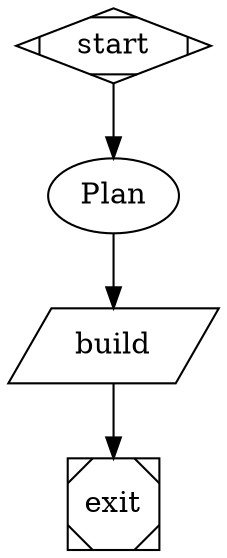

# Attractor

Attractor runs a Graphviz DOT workflow graph — a pipeline of agent, prompt,
command, conditional, and human-gate stages — as a BB-thread-backed process,
with live execution state. This skill covers authoring a graph, running it,
and reading back its progress.

## Authoring a graph

A workflow is a `digraph Name { ... }`. The graph needs exactly one start
node and one exit node:



Node shape (or an explicit `type=` attribute) selects the handler:

| Shape | type= | Handler | Needs |
|---|---|---|---|
| `Mdiamond` | `start` | entry point | — |
| `Msquare` | `exit` | run termination | — |
| `box` (default) | `agent` | full-tool BB worker thread | `prompt` |
| `tab` | `prompt` | single-call worker thread | `prompt` |
| `parallelogram` | `command` | runs a shell script on the environment's host | `script` |
| `hexagon` | `human` | asks a human to choose an outgoing edge (or type free text on a `freeform=true` edge) | — |
| `diamond` | `conditional` | routes on the previous stage's outcome, no work of its own | — |
| `component` | `parallel` | fans out over its outgoing edges | — |
| `tripleoctagon` | `parallel.fan_in` | where fanned-out branches converge | — |

Useful node attributes: `max_visits` (loop cap), `max_retries` (retries a
thrown/infra fault, not a business failure), `goal_gate=true` (the run only
succeeds if every goal-gated node's last outcome was `succeeded` or
`partially_succeeded`), `model`/`provider`/`reasoning_effort` (or a graph-level
`model_stylesheet`), `permission_mode` (`accept-edits`\|`workspace-write`\|
`auto`\|`full`\|`readonly`; a graph-level `default_permission_mode` sets the
fallback; when neither is specified, workers request `auto` — BB's **Approve
for me** mode, which auto-approves within the workspace) — **a spawned worker
still inherits the origin thread's own permission ceiling**, so a node asking
for more than that thread allows gets capped, not upgraded, `output_schema="routing"` (the stage must call the
`attractor_result` tool with a structured routing decision instead of just
answering in text).

Edges route by `condition="outcome=succeeded"` (see the full grammar in the
plan doc), by label (a human gate, or an agent's `preferred_next_label`), or
unconditionally by highest `weight`.

A human gate's outgoing edges are its options — label them with an optional
accelerator prefix (`"[A] Approve"`, `"R) Revise"`, or `"A - Approve"`); add
`freeform=true` to an edge to also accept free text. Add `review_target` (a
workspace-relative path, e.g. `review_target="PLAN.md"`) to show that file
alongside the question — Markdown for a `.md` path, plain text otherwise;
the gate also shows the previous stage's response text (collapsible) and an
"Open thread" link to it, when known. A human answers a
blocked run either by clicking a button in the chat surface, or from a
terminal:

```
bb attractor answer <runId> <label|text>
```

`<label>` matches an option's raw edge label, its accelerator-stripped
text, or its accelerator key, case-insensitively; anything else is only
accepted as free text if the gate is `freeform`. A run blocked on a human
gate shows status `blocked` (`bb attractor status <runId>`) until answered.
A gate with a `timeout` and nothing to answer falls back to the
`human.default_choice` context key if one is set (e.g. via `attractor_run`'s
`inputs`), otherwise the stage fails clearly rather than hanging forever. A gate without a `timeout` waits indefinitely (BB re-shows the prompt every
hour until someone answers). A gate that fails never takes one of its own
option edges — the run stops on the gate's failure unless the graph routes
`condition="outcome=failed"` somewhere explicitly.

**Not yet implemented:** an `agent`/`prompt` node's `output_schema` beyond
the literal string `"routing"` (an inline JSON Schema) is accepted but not
separately validated; only the `routing` shape is checked.

## Running a graph

Call `attractor_run` with either `source` (the DOT text inline) or `path` (a
file in this thread's own environment, resolved relative to its root — a
path that would escape the root is rejected). A successful call returns
`{ runId, previewDirective }`; **emit `previewDirective` exactly once, on its
own line**, so the room sees a live card for the run. The run is validated
and persisted before the call returns, then executed in the background —
it survives a plugin restart from its last checkpoint.

`previewDirective` is `::attractor-run{run="<runId>" thread="<threadId>"}` —
its `thread` attribute (the run's origin thread) means the exact text can be
pasted into any other thread and the card still renders and resolves there.

```
attractor_run({ path: "workflows/plan-implement-review.dot", title: "Ship the fix" })
```

Each agent/prompt stage's prompt includes a bullet per prior stage (node id,
label, status, and up to 400 characters of its response, marked
`…[truncated]` when cut) — the full text is always available to a later
stage via `context.response.<node_id>`. When `context.parallel.results` is
non-empty (a fan-in/digest stage right after a `parallel`/`parallel.fan_in`
pair), the prompt also gets a `Parallel results (N):` section, one bullet
per branch (`- <branch id> | <status>: <text preview>`), so a digest stage
can actually see what each branch said, not just its status.

Every thread also shows a small "active runs" banner just above the message
box, listing any run still `running`/`blocked` for that thread — a quick
status/stage-count/elapsed-time glance (and, for a run blocked on a human
gate, inline answer buttons) with no directive card required.

## Inspecting a run

`attractor_inspect({ runId })` returns the run's status
(`running`/`blocked`/`succeeded`/`failed`/`cancelled`) and every stage's
status, visit count, and (for an agent/prompt stage) its worker `threadId` —
open that thread to read the stage's own conversation.

`blocked` means either a human gate is waiting for an answer, or an
agent/prompt stage's own worker thread is stopped on **its** pending
interaction — a permission prompt, a file-change approval, a plan
confirmation, or a plugin-rendered question, whatever the provider or a
plugin asked mid-turn. A blocked stage's `waitingReason` names what kind of
prompt it is; the DAG card renders that node amber with a "Waiting: `<kind>`
in worker thread" tooltip, and the stage table shows "waiting: `<kind>`"
next to an "Open thread" link. Click the node (or "Open thread") to jump
into the worker thread and answer the prompt like you would in any other
thread; from a terminal instead:

```
bb thread interactions list <workerThreadId>
bb thread interactions approve <interactionId> <workerThreadId>   # or: grant
```

## From a terminal

```
bb attractor validate <path>              # lint a graph, no run
bb attractor run <path> [--input k=v]     # same as the tool, from argv
bb attractor status <runId>
bb attractor stages <runId>
bb attractor events <runId> [--since seq]
bb attractor stop <runId>
bb attractor answer <runId> <label|text>  # answer a blocked human gate
bb attractor --help                       # or `<command> --help` / `help <command>`
```

Every subcommand taking a `<runId>` exits `1` with `no such run: <runId>`
on stderr for an unknown/not-owned run; `answer` also exits `1` when there
is no pending gate to answer, and `stop` exits `1` when the run isn't in
flight.

Add `--field <dot.path>` to any command to print just that value instead of
the full JSON — a scalar prints raw (no quotes), an object/array prints as
JSON, and for an array result (`stages`, `events`) the path is applied to
each element, one per line (e.g. `bb attractor stages <runId> --field
status`). An unknown path exits `1` with `no such field: <path>`.

## Structured results (`output_schema="routing"`)

A stage whose prompt asks for a routing decision must call the
`attractor_result` tool **exactly once**, with:

```json
{
  "outcome": "succeeded",
  "preferred_next_label": "Accept",
  "context_updates": { "reviewed": true }
}
```

`outcome` is required (`succeeded`, `failed`, or `partially_succeeded`);
`preferred_next_label`, `suggested_next_ids`, `failure_reason`, and
`context_updates` are optional. An invalid or missing report gets you a
follow-up message in the same thread asking to correct it (up to twice)
before the stage is recorded as failed.
